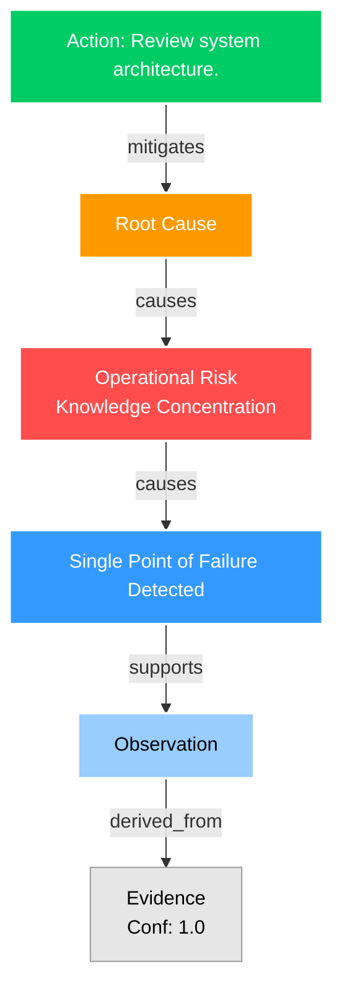

# Reasoning Operating System: Executive Intelligence Report
> [!TIP]
> This report was generated deterministically via pure graph topology. The LLM was used strictly for narrative styling.

## Executive Summary
This is a beautifully styled, authoritative executive summary warning of severe operational risk due to a single point of failure in a critical module.

## Prioritized Risk Inferences
| Priority | Insight | Score | Source |
| :--- | :--- | :--- | :--- |
| **Low** | Single Point of Failure Detected | 39.6/100 | Graph Topology |

## Automated Mitigation Plans
- **Action**: Review system architecture.
  - **Status**: ALLOCATED (Job: `job_mitigate_recommendation_2079dbe72e27`)
  - **Pareto Metrics**: Expected Benefit: 100.0 | Cost: 50.0 | Leverage: 1.96x

## Mathematical Proof of Reasoning (Topology)
The exact evidence chain proving these conclusions:

### Lineage Trace for Top Inference: Single Point of Failure Detected
- `recommendation`: {'action': 'Review system architecture.', 'leverage_score': 1, 'status': 'ALLOCATED', 'expected_benefit': 100.0, 'implementation_cost': 50.0, 'execution_time_hours': 4.0, 'risk_reduction': 1.9607843137254901, 'confidence': 1.0, 'job_id': 'job_mitigate_recommendation_2079dbe72e27'}
- `root_cause`: {'title': 'Root Cause: Operational Risk', 'description': 'Fundamental root cause identified in Repository. Supports 0 downstream inferences.', 'severity': 0.9, 'generated_by': 'RootCauseAnalyzer_v1', 'rule_id': 'unknown', 'rule_version': 'unknown', 'dependencies': ['evidence_56941743d109'], 'leverage_score': 1, 'pareto_metrics': {'expected_benefit': 100.0, 'implementation_cost': 50.0, 'execution_time_hours': 4.0, 'risk_reduction': 1.9607843137254901, 'is_pareto_optimal': True}}
- `impact`: {'business_domain': 'Operational Risk', 'specific_risk': 'Knowledge Concentration', 'description': 'Technical issue causes Operational Risk'}
- `inference`: {'insight': 'Single Point of Failure Detected', 'risk_level': 'High', 'priority_score': 39.60000000000001, 'priority_label': 'Low'}

