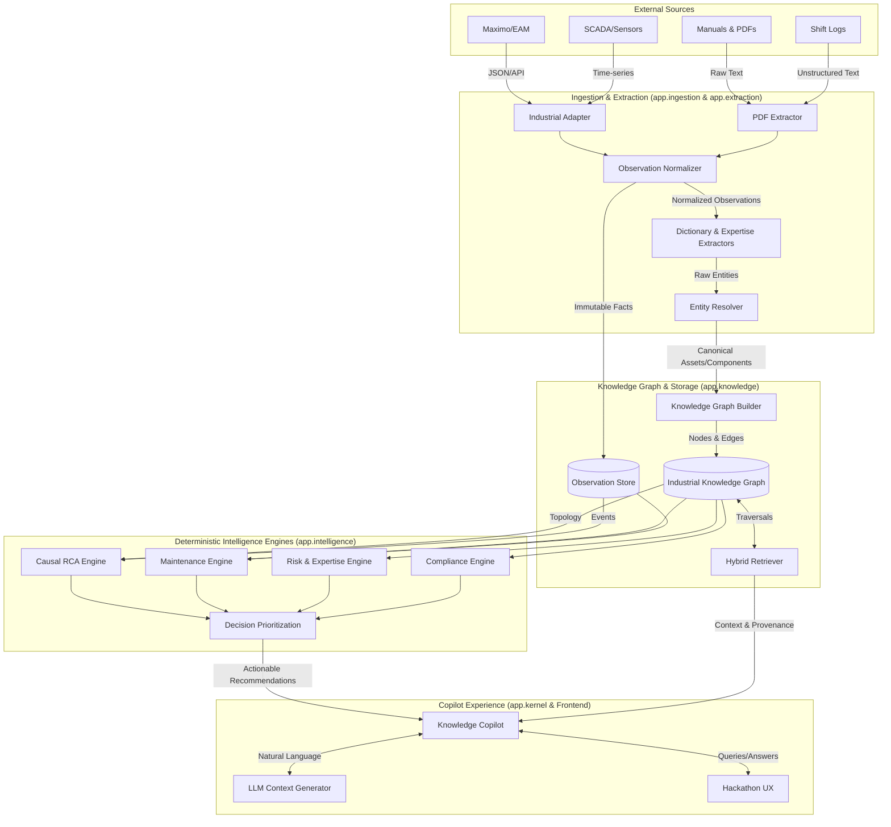

# PIA Industrial: Unified Asset & Operations Brain

## System Architecture

The following diagram illustrates the data flow and system boundaries of the PIA Industrial platform.

## Key Principles
1. **LLMs understand language. Deterministic engines compute facts.**
2. All counterfactual simulations, causal tracking, and maintenance scoring are executed by deterministic graph algorithms.
3. The LLM simply provides the linguistic interface to explain these deterministic insights with strict provenance.

## System Context
PIA Industrial acts as the intelligence layer sitting above legacy industrial systems (Maximo, SAP EAM, SCADA historians) and unstructured knowledge repositories (SharePoint manuals, shift logs). It ingests this fragmented data, normalizes it into a unified ontology, and computes operational insights.

## Major Components
1. **app.ingestion**: Normalizes unstructured text and APIs into immutable `Observation` facts.
2. **app.extraction**: Resolves raw strings ("main pump", "P-101") into canonical `EntityRef` objects.
3. **app.knowledge**: Maintains the `IndustrialGraphManager` (NetworkX) and the `ObservationStore` (SQLite).
4. **app.intelligence**: The suite of deterministic engines (Causal RCA, Counterfactuals, Compliance, Maintenance).
5. **app.kernel**: The Copilot runtime that safely interfaces with the LLM.

## Canonical Data Pipeline
1. **Ingest**: A shift log is uploaded.
2. **Extract**: NLP identifies "high vibration" on "P-101".
3. **Persist**: The fact is saved to the SQLite `ObservationStore`.
4. **Graph Build**: The `KnowledgeGraphBuilder` adds an edge from `Observation` -> `P-101`.
5. **Compute**: The `IndustrialCausalRCA` engine triggers, analyzing the graph topology to identify "Mechanical Wear" as the root cause.
6. **Decide**: The `DecisionIntelligenceService` flags P-101 for immediate intervention.
7. **Interact**: The user asks the Copilot, "Why did P-101 fail?" The Copilot fetches the exact causal chain and cites the original shift log.

## Deterministic vs LLM Responsibilities
| Responsibility | Engine |
|---|---|
| Computing Risk Scores | Deterministic (`Risk & Expertise Engine`) |
| Identifying Root Causes | Deterministic (`Causal RCA Engine`) |
| Simulating Interventions | Deterministic (`Counterfactual Engine`) |
| Parsing Natural Language Queries | LLM (`Copilot Context Generator`) |
| Summarizing Findings | LLM (`Copilot Answer Builder`) |

## Persistence Layer
- **Observation Store**: SQLite relational database storing immutable facts.
- **Knowledge Graph**: In-memory NetworkX graph representing the current topological state. (Planned migration to Neo4j/Memgraph for scale).

## API & Frontend
- **API**: FastAPI providing REST endpoints for ingestion, graph querying, and Copilot execution.
- **Frontend**: React application utilizing Vanilla CSS for a premium industrial UI.

## Trust Boundaries
- All user input is sanitized before entering the extraction pipeline.
- The LLM is **never** granted write access to the Knowledge Graph or the Observation Store. It only has read access via strictly typed Tool bindings.
