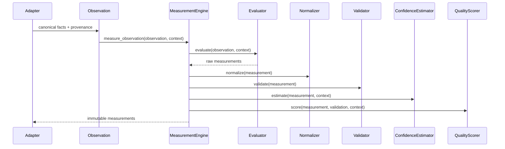

# Measurement Layer Architecture

## Purpose

The Measurement Layer is the deterministic processing stage between canonical
observations and evidence.

```text
Adapters
  -> Canonical Observation
  -> Measurement Layer
  -> Evidence Intelligence Platform
  -> Expertise Layer
  -> Reasoning Layer
```

Observation preserves what happened. Measurements compute reproducible
quantities from those observations. Evidence interprets those quantities.

## Design Rules

- Measurements are immutable.
- Measurements are deterministic for the same input observation and version.
- Observations are never modified.
- Every value carries unit, method, normalization, confidence, uncertainty,
  validation, quality, provenance, traceability and dependencies.
- ML and LLM systems may calibrate or annotate measurements, but deterministic
  measurement outputs remain the source of record.
- New algorithms are plugins behind interfaces, not edits to existing engines.

## Package Structure

```text
app/measurement
  ontology.py        concept hierarchy and scientific meaning
  registry.py        immutable definition registry and version lookup
  catalog.py         standards-backed default measurement definitions
  domain.py          immutable measurement model
  interfaces.py      evaluator, normalizer, validator, scorer interfaces
  engine.py          orchestration pipeline
  normalization_pipeline.py
                     cleaning, calibration, scaling and bias correction
  normalization.py   unit conversion and normalization strategies
  validation.py      schema, range and value validation
  confidence.py      deterministic reliability estimation
  quality.py         measurement quality scoring
  formula.py         derived measurement formulas
  composite.py       weighted composite measurements
  fusion.py          multi-source measurement fusion
  lineage.py         provenance DAG and explanation API
  store.py           temporal store and cache tiers
  recompute.py       dependency graph for affected-node recomputation
  dsl.py             customer-defined measurement language
  benchmark.py       contextual percentile benchmarks
  accuracy.py        enterprise accuracy gate before evidence
  active.py          active observation requests for low confidence
  compression.py     reservoir sampling and approximate histograms
  contracts.py       measurement contracts and lifecycle states
  execution.py       DAG planner, executor and cost optimizer
  knowledge_base.py  references, limitations and interpretation guidance
  lineage_query.py   path and dependent queries over lineage DAGs
  mql.py             query language for measurement consumers
  packs.py           metric packs and marketplace installation
  semantic_graph.py  graph relationships between measurement concepts
  streaming.py       observation-driven measurement updates
  signals.py         universal signal registry
  signal_ontology.py semantic signal ontology
  signal_classifier.py
                     layered signal classification
  mapping.py         signal-to-measurement mapping
  signal_validation.py
                     signal and semantic mapping validation
  standards.py       standards metadata catalog
  domain_packs.py    domain measurement packs
  measurement_knowledge.py
                     scientific measurement knowledge base
  benchmark_datasets.py
                     benchmark datasets and scopes
  knowledge_api.py   signal and measurement knowledge APIs
  scientific_catalog.py
                     enterprise software measurement catalog
  accuracy_profiles.py
                     expected error, bias, reliability and failure metadata
  scientific_validation.py
                     scientific validation reports and catalog validation
  confidence_calibration.py
                     empirical confidence calibration
  test_corpus.py     synthetic validation datasets
  scientific_api.py  benchmark and validation APIs
  statistical.py     mean, variance, correlation, entropy, KL divergence
  statistical_pipeline.py
                     distribution, outlier and confidence interval report
  graph.py           graph density, degree centrality, SCCs
  time_series.py     moving averages, EWMA, trend estimation
  outliers.py        z-score, IQR and MAD outlier detection
  drift.py           metric, distribution and schema drift detection
  plugins.py         extension registry
  ml.py              optional ML calibration boundary
  evaluators/
    complexity.py    churn, files changed, complexity delta, entropy
    impact.py        surface area and review attention need
```

## Domain Model

```text
MeasurementConcept
  id
  display_name
  scientific_meaning
  category
  parent_id
  dimensions
  references

MeasurementDefinition
  id
  name
  description
  category
  unit
  expected_range
  formula
  dependencies
  required_signals
  confidence_model
  validator
  normalizer
  aggregation_strategy
  version
  deprecated
  references

Measurement
  id
  definition
  unit
  value
  confidence
  uncertainty
  quality_score
  measurement_method
  normalization_method
  provenance
  timestamp
  version
  traceability
  dependencies
  validation_status
  metadata
```

The `MeasurementDefinition` defines the stable contract: concept id, unit,
version, bounds and tags. The `Measurement` records a specific immutable value
computed by a specific method at a specific pipeline version.

## Ontology And Registry

The platform now measures concepts, not only values. `MeasurementOntology`
defines scientific concepts such as maintainability, complexity, change impact
and information distribution. `MeasurementRegistry` stores immutable definition
versions and supports latest-version lookup, concept lookup and historical
reproducibility.

Default definitions are shipped through `DefaultMeasurementCatalog` and include
standards references to ISO/IEC 25010, ISO/IEC 15939 and GUM-inspired
measurement uncertainty practice.

## Pipeline

```text
Observation
  -> MeasurementEvaluator
  -> NormalizationPipeline
       -> Cleaning
       -> Calibration
       -> Scaling
       -> Bias Correction
  -> MeasurementNormalizer
  -> MeasurementValidator
  -> ConfidenceEstimator
  -> QualityScorer
  -> Measurement[]
```

Enterprise batches then pass through an accuracy gate before the Evidence
Intelligence Platform receives them:

```text
Measurement[]
  -> Signal Quality Assessment
  -> Duplicate Removal
  -> Missing Data Annotation
  -> Outlier Detection
  -> Cross-Source Verification
  -> Probabilistic Fusion
  -> Benchmark Context
  -> Integrity Validation
  -> Evidence Intelligence Platform
```

Default evaluators currently compute:

- `code_churn`
- `files_changed`
- `patch_complexity_delta`
- `change_distribution_entropy`
- `change_surface_area`
- `review_attention_need`

## Sequence



## Extension Points

Add a measurement algorithm by implementing `MeasurementEvaluator`.

Add a normalization strategy by implementing `MeasurementNormalizer`.

Add a validation rule by implementing `MeasurementValidator`.

Add confidence or quality behavior by implementing `ConfidenceEstimator` or
`QualityScorer`.

Register extensions through `MeasurementPluginRegistry`, then pass the
registered components into `MeasurementEngine`.

## Contracts And Lifecycle

`MeasurementContract` declares required input signals, output unit, precision,
confidence model, lifecycle state, assumptions and known limitations.

Lifecycle states:

```text
Draft -> Experimental -> Validated -> Production -> Deprecated -> Archived
```

Deprecated and archived contracts fail contract validation, preventing unsafe
metric packs or customer DSL definitions from silently flowing into evidence.

## Computation DAG And Planner

Measurements can be modeled as a DAG of `MeasurementComputationNode` objects.
`MeasurementExecutionPlanner` resolves dependencies and emits a topological
execution plan. `MeasurementExecutor` reuses cached results and only computes
missing nodes.

`CostBasedMeasurementOptimizer` chooses the lowest-cost computation path that
satisfies requested confidence and latency constraints.

## Semantic Graph And Knowledge Base

`SemanticMeasurementGraph` represents concept relationships beyond a tree:
depends on, related to, opposes, derived from, causes and correlates with.

`MeasurementKnowledgeBase` stores scientific references, standards, known
limitations, interpretation guidance, anti-patterns and normalization notes.

## Derived and Composite Measurements

`DerivedMeasurementEngine` evaluates safe arithmetic formulas over existing
measurement IDs. It preserves dependency IDs, formulas and linear uncertainty
propagation.

Example:

```text
change_risk = code_churn * review_attention_need
```

`WeightedCompositeEngine` builds weighted composite formulas for scorecards,
hierarchies and ensemble-style aggregation.

## Multi-Source Fusion

`MultiSourceFusionEngine` combines measurements of the same concept from
multiple sources using confidence-weighted fusion. It records source count,
agreement, dependency IDs and fusion transformation lineage.

`ProbabilisticFusionEngine` adds a precision-weighted Bayesian-style fusion
path. Source measurements remain intact while the fused result records posterior
variance, agreement and dependency lineage.

## Confidence, Uncertainty and Quality

Confidence is a deterministic reliability estimate based on:

- source reliability
- coverage
- source agreement
- freshness
- historical stability
- missing data penalty

Uncertainty is represented as an interval and variance. This is not latent-state
inference. It is measurement reliability metadata.

Derived formulas use finite-difference uncertainty propagation so nonlinear
formula outputs inherit uncertainty from their dependencies.

Quality combines:

- confidence
- uncertainty width
- validation result

## Lineage And Explainability

`MeasurementLineageService` builds a DAG from source observation to adapter,
definition, measurement and derived dependencies.

`MeasurementLineageQueryEngine` supports path and dependent queries over that
graph.

`MeasurementExplainer` answers the UI/debug questions:

- why this metric exists
- how it was computed
- where it came from
- confidence and factor breakdown
- uncertainty
- dependencies
- normalization
- formula
- version
- validation status

## Temporal Store, Cache And Recomputation

`TemporalMeasurementStore` appends measurements over time instead of
overwriting them. This supports trend, velocity, acceleration and forecast-ready
queries.

`MeasurementCache` separates hot, derived, historical and persistent cache
tiers.

`MeasurementDependencyGraph` records dependency edges and returns the affected
derived nodes when a source measurement changes.

## DSL, MQL And Benchmarks

`MeasurementDslParser` supports customer-defined measurements such as:

```text
measure Risk
from Complexity
from Ownership
formula Complexity * Ownership
confidence Bayesian
validator Range
normalizer Percentile
```

`BenchmarkEngine` compares measurements against repository, team,
organization, industry or OSS cohorts and produces percentile context.

`MqlParser` and `MqlEngine` provide a small query language for dashboards and
integrations:

```text
SELECT code_churn
WHERE confidence > 0.9
ORDER BY quality_score
```

## Streaming, Active Measurement And Packs

`StreamingMeasurementEngine` accepts observations and publishes measurement
updates to subscribers for observation-driven recomputation.

`ActiveMeasurementService` requests additional adapter observations when
confidence is low.

`MeasurementPack` and `MeasurementMarketplace` model domain-specific metric
packs that can be installed per tenant.

## Compression

`ReservoirSampler` and `ApproximateHistogramBuilder` provide initial
dependency-free compression primitives for large histories.

## ML Calibration

`MlCalibrationService` applies optional ML calibration as an auditable
post-measurement transformation:

```text
Raw Measurement
  -> ML Calibration
  -> Bias Correction
  -> Confidence Adjustment
  -> Final Measurement
```

The deterministic measurement remains the source of record through dependency
and metadata lineage.

## SaaS Readiness

The layer is designed for:

- batch execution with `measure_observations`
- streaming execution with per-observation `measure_observation`
- tenant isolation through `MeasurementContext.tenant_id`
- versioned algorithms and definitions
- auditability through provenance and traceability
- incremental recomputation through stable deterministic IDs
- execution planning and cost optimization
- queryability through MQL
- installable metric packs
- active observation requests
- compressed summaries for large histories
- future distributed execution because evaluators are stateless

## Evidence Intelligence Platform Contract

The Evidence Intelligence Platform must consume only `Measurement` objects that
have passed the Measurement Layer integrity gate. It should never calculate raw
metrics itself.

Before evidence, each measurement should be normalized, validated,
confidence-scored, uncertainty-aware, benchmarked when a cohort exists,
explainable, versioned, reproducible and traceable through lineage.

The Expertise Layer must consume only evidence packages. It must never directly
consume measurements.

## Signal Intelligence

M33 adds signal intelligence before measurement execution:

```text
SoftwareSignal
  -> SignalRegistry
  -> SignalOntology
  -> SemanticSignalClassifier
  -> SignalToMeasurementMapper
  -> MeasurementDefinition
  -> MeasurementEngine
```

This allows future adapters to register new signals dynamically while preserving
the Evidence contract.

## Scientific Validation

M34 adds scientific validation after signal intelligence and before evidence:

```text
MeasurementDefinition
  -> AccuracyProfile
  -> ScientificValidationEngine
  -> BenchmarkDatasetRegistry
  -> ConfidenceCalibrationModel
  -> ScientificMeasurementApi
```

The enterprise catalog gives each measurement a scientific definition, business
interpretation, formula, required signals, uncertainty model, benchmark
strategy, validation rules, assumptions, limitations and version history.

## Testing Strategy

Current validation:

```text
backend/scripts/test_measurement_engine.py
```

This covers:

- default pipeline execution
- deterministic commit measurements
- validation status
- confidence and quality ranges
- derived formula lineage
- multi-source fusion lineage

Future test layers:

- unit tests for each evaluator, normalizer and validator
- property tests for deterministic IDs and range guarantees
- integration tests against captured canonical observations
- regression fixtures for tool normalization differences
- benchmark tests for high-volume event batches

## Benchmark Strategy

Initial benchmark dimensions:

- events per second
- measurements per second
- p50, p95 and p99 latency per evaluator
- memory per 10k observations
- recomputation rate when only one source changes
- fusion cost by source count

## Future Roadmap

- Measurement repository and replay API.
- Arrow or Polars batch execution once volume requires it.
- DuckDB-backed analytical cache for historical measurement queries.
- OpenTelemetry spans around evaluator and validator execution.
- Stronger uncertainty propagation for nonlinear formulas.
- Bayesian calibration boundary after deterministic measurements are stable.
- Static-analysis plugins for AST, CFG and dependency graphs.
- Cross-tool normalization for Sonar, CodeScene, Lizard and compiler metrics.
- LLM-assisted semantic measurement with reproducibility manifests.
