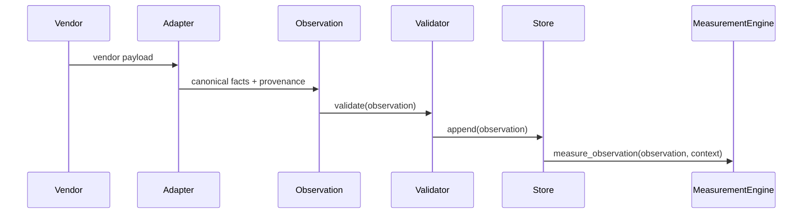

# Observation Layer Architecture

## Purpose

The Observation Layer is the vendor-agnostic platform boundary that faithfully
preserves software reality.

```text
Vendor Payload
    |
    v
Adapter
    |
    v
Canonical Observation
    |
    v
Validation
    |
    v
Registry
    |
    v
Observation Store
    |
    v
Measurement Operating System
```

Observation stops at storage and delivery. It never calculates measurements,
infers evidence, estimates confidence, assigns risk, normalizes business
meaning, or performs reasoning.

## Domain Model

`app.observation.domain.Observation` is frozen and immutable. It contains:

- observation id, trace id, correlation id, timestamp
- observation type and category
- source platform and source adapter
- version and lifecycle
- actors and targets
- provenance and context
- strongly typed canonical facts

Canonical facts include `CommitFacts`, `PullRequestFacts`, `IssueFacts`,
`ReviewFacts`, `BuildFacts`, `DeploymentFacts`, `RuntimeFacts`,
`SecurityFacts`, `TestFacts`, `CloudFacts`, `InfrastructureFacts`,
`DocumentationFacts`, and `AISystemFacts`.

## Ontology

Categories are vendor-independent:

```text
Source Control, Code Review, CI/CD, Runtime, Security, Testing, Cloud,
Infrastructure, Documentation, AI, Project Management
```

Relationships are vendor-independent:

```text
produced_by, belongs_to, references, affects, precedes, follows, generates,
related_to
```

## Registry

`ObservationRegistry` defines each observation type with schema, category,
required fields, optional fields, validation rules, supported adapters, version,
and lifecycle.

The Measurement Layer depends on the registry contract, not on vendor names.

## Validation

`ObservationValidationPipeline` runs before storage and before Measurement:

- schema and fact type validation
- timestamp validation
- duplicate detection
- malformed and required field checks
- source adapter checks
- version and lifecycle checks
- ontology category checks

Invalid observations are rejected and must never reach Measurement.

## Store And Streaming

`ObservationStore` is append-only and rejects duplicate observation ids. It
supports replay, correlation history, incremental reads, batching, and
historical reconstruction.

`ObservationStream` publishes immutable batches with sequence and offset.

## Adapter Responsibilities

Adapters may:

- authenticate
- fetch data
- parse payloads
- translate vendor models into canonical observations
- preserve provenance

Adapters must not:

- calculate semantic measurements
- estimate complexity, risk, confidence, uncertainty, or maintainability
- create evidence
- rank, normalize, or interpret business meaning

## Measurement Integration

Measurement consumes only:

```python
Observation
```

Measurement never consumes raw vendor payloads, REST DTOs, JSON dictionaries, or
vendor SDK objects. Legacy `Event` compatibility remains only as an adapter
bridge and is not the architectural contract.

## Sequence



## Final M36 Audit

1. Can every supported vendor be translated into canonical observations without
   changing Measurement? Yes for the supported canonical schemas; additional
   vendors add adapters and registry entries only.
2. Does Observation contain zero measurement logic? Yes. Measurement formulas
   remain in `app.measurement`.
3. Does Observation contain zero evidence logic? Yes.
4. Does Measurement consume only canonical Observation objects? Yes for the
   canonical API: `measure_observation` and `measure_observations`. Deprecated
   `measure_event` bridges legacy callers by translating to `Observation`.
5. Are there vendor-specific leaks above Observation? No known leaks in the new
   canonical flow. Legacy scripts may still create compatibility events.
6. Are all observation models strongly typed instead of opaque dictionaries?
   Yes for canonical facts. Adapter input remains vendor payload data by
   necessity, but it is not exposed through `Observation`.
7. Are all adapters acting purely as translators? The canonical GitHub adapter
   fetches and translates only. Legacy compatibility exists for old callers.
