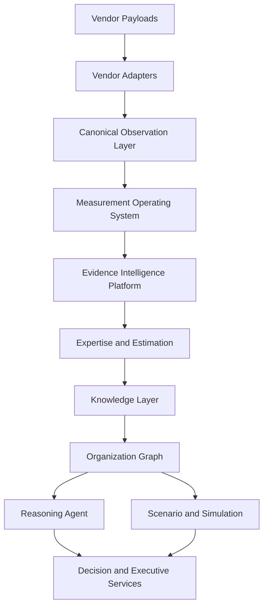

# PIA Architecture Bible

## Purpose

This folder is the permanent architecture knowledge base for the PIA Latent Engine. It is intended to let a new principal engineer understand, maintain, extend, optimize, and redesign the system without relying on undocumented memory.

## Scope

The bible covers the canonical platform as of July 2026: Observation, Measurement, Evidence, Expertise, Knowledge, Graph, Reasoning, Forecasting, Simulation, Decision, Executive reporting, implementation status, research history, gaps, and roadmap.

## Background

PIA began as an Event -> Evidence -> Expertise analytics pipeline. It has evolved into a scientific intelligence operating system built around immutable observations, deterministic measurements, validated evidence, semantic expertise, graph-backed knowledge, reasoning, and decision support.

## Complete Explanation

Read this folder in this order:

1. [01_Project_Vision.md](01_Project_Vision.md)
2. [02_System_Architecture.md](02_System_Architecture.md)
3. [03_Domain_Model.md](03_Domain_Model.md)
4. [04_Component_Architecture.md](04_Component_Architecture.md)
5. [06_Data_Flow.md](06_Data_Flow.md)
6. [07_Control_Flow.md](07_Control_Flow.md)
7. [research/Research_Timeline.md](research/Research_Timeline.md)
8. [measurement_engine/Overview.md](measurement_engine/Overview.md)
9. [implementation/Current_Status.md](implementation/Current_Status.md)
10. [gaps/Gap_Register.md](gaps/Gap_Register.md)

The canonical runtime stack is:

```text
Vendor data
  -> Observation
  -> Measurement
  -> Evidence
  -> Expertise
  -> Knowledge
  -> Organization Graph
  -> Reasoning
  -> Forecasting / Simulation
  -> Decision
  -> Executive Intelligence
```

## Architecture Diagram



## Design Decisions

- Observation is the source of truth for software reality.
- Measurement is the only layer allowed to quantify observations.
- Evidence is the only bridge from measurement into expertise.
- Expertise must not directly consume observations or raw measurements.
- Decisions must be explainable back to supporting evidence, measurements, observations, and vendor facts.

## Tradeoffs

The canonical architecture is more verbose than the original heuristic pipeline, but it buys explainability, reproducibility, scientific validation, uncertainty propagation, and safer extension.

## Failure Cases

- Missing vendor credentials prevent live collection.
- Weak observation coverage limits downstream intelligence.
- Thin measurement ontologies produce narrow evidence.
- File-centric expertise causes shallow organizational conclusions.
- Rule-only reasoning can explain less than the lineage can prove.

## Edge Cases

- Legacy `Event` objects still exist for compatibility.
- Some showcase scripts may build fixture-like flows outside production adapters.
- Measurements with warning validation may enter evidence when explicitly allowed.

## Complexity Analysis

Most current components are in-memory and linear in observation, measurement, or evidence count. Graph analytics can become O(V + E) for traversal, O(VE) or worse for some centrality/community methods, and should eventually move to persisted/indexed graph execution.

## Current Implementation Status

Observation and Measurement are the strongest canonical layers. Evidence is mature as a platform but needs many more definitions. Expertise, Knowledge, Graph reasoning, Forecasting, Simulation, and Decision exist but need semantic enrichment.

## Known Limitations

The bible is a living document. It captures the current architecture and research trail, but future milestones should update it whenever contracts, algorithms, gaps, or design decisions change.

## Future Improvements

- Add generated API references from source code.
- Add production deployment and tenant isolation manuals.
- Add benchmark output snapshots.
- Add ADR links from every design decision.

## Related Documents

- [../CANONICAL_PLATFORM_ANALYSIS_AND_ROADMAP.md](../CANONICAL_PLATFORM_ANALYSIS_AND_ROADMAP.md)
- [../architecture.md](../architecture.md)
- [../architecture/current_architecture.md](../architecture/current_architecture.md)

