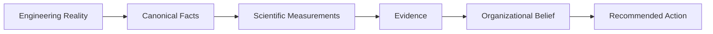

# Project Vision

## Purpose

Define what PIA is becoming and what architectural decisions must preserve.

## Scope

This document covers product philosophy, system identity, user value, and long-term direction.

## Background

The project moved beyond a dashboard that counts engineering activity. Its direction is an organizational intelligence operating system that observes engineering reality, measures it scientifically, reasons over it, and recommends action.

## Complete Explanation

PIA answers questions such as:

- Who understands this subsystem?
- What knowledge is concentrated in one person?
- What happens if a developer leaves?
- Which files, modules, teams, or technologies are risky?
- Which interventions reduce risk fastest?
- Why did the system reach this conclusion?

The central product promise is explainable engineering intelligence. Every recommendation should trace backward through reasoning, knowledge, evidence, measurements, observations, and original vendor facts.

## Mathematical Foundations

The project is grounded in latent-state estimation:

```text
hidden organizational state x_t
observations y_t
measurements m_t = f(y_t)
evidence e_t = g(m_t)
belief p(x_t | e_1:t)
decision a_t = argmax utility(a, x_t, constraints)
```

Current implementation is mostly deterministic and rule-based, but the roadmap points toward Bayesian updates, uncertainty propagation, graph centrality, information theory, and decision-theoretic optimization.

## Architecture Diagram



## Design Decisions

- Build a scientific foundation before adding more executive features.
- Prefer immutable records and replay over mutable state.
- Treat confidence, uncertainty, and provenance as first-class data.
- Preserve failed research ideas so future architects do not repeat them.

## Tradeoffs

PIA prioritizes trustworthiness over speed of feature accumulation. This slows early product velocity but avoids compounding hidden assumptions.

## Failure Cases

- The platform becomes a metric dashboard instead of an intelligence system.
- Recommendations lose traceability.
- Organizational state is inferred from incomplete evidence without uncertainty.

## Edge Cases

- Some teams produce little observable activity, requiring active measurement or qualitative sources.
- High activity does not always imply expertise.
- Silent experts may not appear in GitHub-derived signals.

## Complexity Analysis

The vision requires multiple computational regimes: linear ETL-like processing, statistical calibration, graph algorithms, time-series forecasting, and constrained optimization.

## Current Implementation Status

The lower scientific stack exists. The upper semantic intelligence stack is present but early.

## Known Limitations

The current platform still over-relies on software repository signals and file-level expertise.

## Future Improvements

- Add team, subsystem, technology, and runtime signals.
- Add richer causal reasoning and counterfactual simulation.
- Optimize decisions under budget, staffing, and time constraints.

## Related Documents

- [roadmap/Ultimate_Vision.md](roadmap/Ultimate_Vision.md)
- [appendix/Design_Principles.md](appendix/Design_Principles.md)
- [research/Mathematical_Foundations.md](research/Mathematical_Foundations.md)

