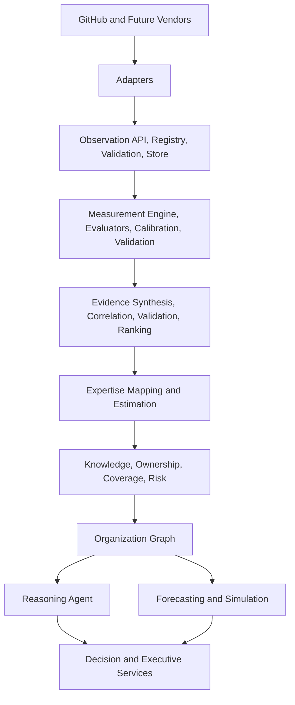
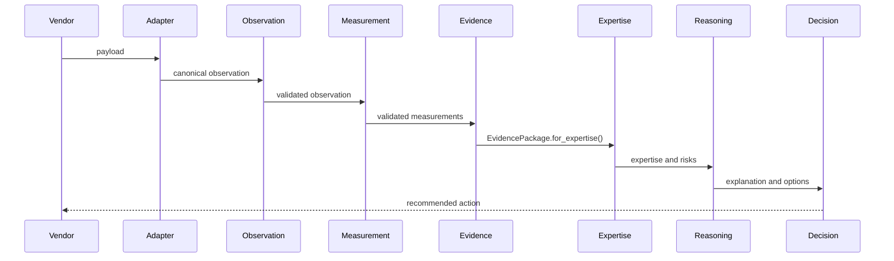

# System Architecture

## Purpose

Describe the canonical end-to-end architecture and the contracts between layers.

## Scope

This document covers the full platform shape, including adapters, observations, measurements, evidence, expertise, knowledge, graph, reasoning, simulation, decision, and executive services.

## Background

Earlier milestones used `domain.Event` and direct evidence extraction. The canonical architecture now uses `app.observation.domain.Observation` as the vendor-neutral base and `app.measurement` as the deterministic quantification layer.

## Complete Explanation

Layer responsibilities:

- Vendor adapters fetch external payloads and translate them.
- Observation preserves immutable, vendor-neutral facts.
- Measurement computes validated, unit-aware, confidence-scored quantities.
- Evidence synthesizes trustworthy conclusions from measurements.
- Expertise maps evidence to human and subsystem capability.
- Knowledge stores semantic organizational memory.
- Graph links developers, files, modules, technologies, risks, and evidence.
- Reasoning composes answers and explanations.
- Forecasting and simulation project likely futures.
- Decision and executive services recommend action.

## Mathematical Foundations

The layer split separates data generation from inference:

```text
O = immutable observations
M = deterministic measurements f(O)
E = evidence synthesis g(M)
K = knowledge aggregation h(E)
R = reasoning over K, graph G, and constraints C
D = decision policy pi(R, C)
```

## Architecture Diagram



## Sequence Diagram



## Design Decisions

- Strict layer contracts prevent semantic leakage.
- Evidence is the exclusive bridge to expertise.
- Immutable objects preserve replayability.
- Each layer carries provenance and version metadata.

## Tradeoffs

Strict contracts require translation layers and more object types. The payoff is independent evolution and auditability.

## Failure Cases

- Direct measurement access from expertise violates the contract.
- Adapters that compute risk leak vendor-specific assumptions upward.
- Evidence definitions that calculate measurements duplicate Measurement logic.

## Edge Cases

- Legacy event compatibility exists for old scripts.
- Some layer APIs are currently in-memory and will need persistence boundaries.
- Warning-grade measurements require explicit evidence policy.

## Complexity Analysis

Batch processing is approximately O(n) through observation and measurement. Evidence synthesis is O(m * r) for measurements and rules, improved by grouping by target entity. Graph and forecasting costs depend on selected algorithms.

## Current Implementation Status

Implemented packages include `backend/app/observation`, `measurement`, `evidence`, `expertise_mapping`, `estimator`, `graph`, `agent`, `forecasting`, `scenario`, `simulation`, `decision`, `executive`, and organization intelligence services.

## Known Limitations

The architecture is stronger than the current semantic models. Upper layers need richer domain definitions and graph-native algorithms.

## Future Improvements

- Persist observations, measurements, evidence, and graph snapshots.
- Add API boundaries and OpenTelemetry spans.
- Expand adapters beyond GitHub.

## Related Documents

- [06_Data_Flow.md](06_Data_Flow.md)
- [07_Control_Flow.md](07_Control_Flow.md)
- [measurement_engine/Measurement_Pipeline.md](measurement_engine/Measurement_Pipeline.md)

