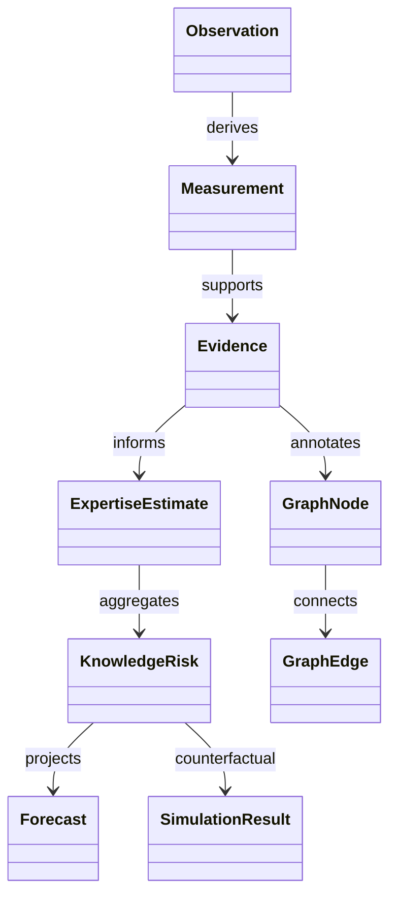

# Domain Model

## Purpose

Define the core entities and semantic contracts used by PIA.

## Scope

This document covers observations, measurements, evidence, expertise, knowledge, graph entities, forecasts, scenarios, decisions, and legacy compatibility objects.

## Background

The old domain model centered on `Event`, `Evidence`, `EntityRef`, and `ExpertiseEstimate`. The canonical model retains legacy objects but moves the primary source abstraction to `Observation`.

## Complete Explanation

Core entities:

- `Observation`: immutable vendor-neutral fact.
- `Measurement`: deterministic quantitative value derived from observations.
- `Evidence`: validated interpretation of measurements.
- `EvidencePackage`: evidence bundle safe for expertise consumers.
- `ExpertiseEstimate`: estimated relation between a developer/entity and a target.
- `ExpertiseProfile`: aggregate expertise view.
- `KnowledgeRisk`: risk derived from concentrated or insufficient knowledge.
- `GraphNode` and `GraphEdge`: organization graph primitives.
- `Forecast`: projected future metric/risk state.
- `SimulationScenario` and `SimulationResult`: counterfactual analysis.
- `ReviewerRecommendation`, `ExecutiveRecommendation`, `Roadmap`, `QuarterPlan`: decision outputs.

## Mathematical Foundations

An expertise estimate is a confidence-scored relation:

```text
expertise(developer, target, time) = score in [0, 1], confidence in [0, 1]
```

Evidence strength and confidence are bounded factors. Decay applies time-based attenuation:

```text
score_t = score_0 * exp(-lambda * delta_t)
```

## Architecture Diagram



## Design Decisions

- Domain objects are preferably immutable snapshots.
- History is reconstructed from replay rather than mutating records.
- References use lightweight entity references instead of embedded objects.

## Tradeoffs

Immutability increases object count, but makes reproducibility and audit much simpler.

## Failure Cases

- Treating activity as expertise without confidence or context.
- Collapsing developer, alias, and account identities incorrectly.
- Losing target granularity by using only files instead of subsystems or technologies.

## Edge Cases

- One observation can support multiple measurements.
- One measurement can support multiple evidence items.
- Evidence can support or contradict a hypothesis.
- A developer can be expert in a subsystem but not in every file inside it.

## Complexity Analysis

Domain object creation is O(1). Aggregations over observations, measurements, evidence, or graph neighborhoods are O(n) unless indexed.

## Current Implementation Status

Canonical dataclasses and enums exist across `backend/app/observation/domain`, `measurement/domain`, `evidence/domain`, `expertise_mapping`, `knowledge_risk`, `graph`, `forecasting`, `simulation`, `decision`, and `executive`.

## Known Limitations

The semantic knowledge object is not yet as explicit as Observation, Measurement, or Evidence.

## Future Improvements

- Promote subsystem, technology, team, and repository as first-class targets.
- Add persistent schema definitions.
- Add explicit knowledge object lifecycle and lineage.

## Related Documents

- [estimation/Expertise_Model.md](estimation/Expertise_Model.md)
- [graph/Graph_Model.md](graph/Graph_Model.md)
- [appendix/Glossary.md](appendix/Glossary.md)

