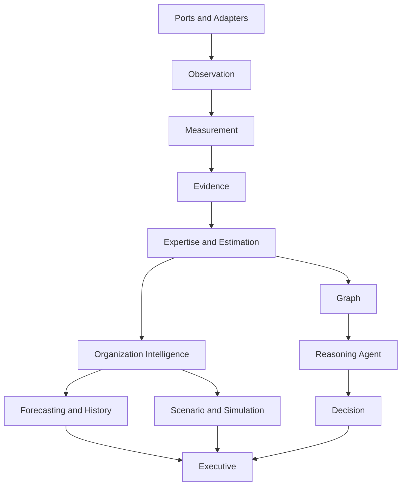

# Component Architecture

## Purpose

Catalog major components, responsibilities, dependencies, interfaces, workflows, data structures, algorithms, and future evolution.

## Scope

This document covers package-level architecture under `backend/app`.

## Background

PIA is organized as small Python modules with dataclass domain models, service classes, policy interfaces, and simple in-memory orchestration.

## Complete Explanation

### Observation

Responsibilities: canonical fact model, validation, registry, storage, streaming, vendor translation.

Dependencies: adapters and source ports below; measurement above.

Public interfaces: `ObservationPipeline`, `ObservationApi`, `ObservationStore`, `ObservationStream`, `ObservationRegistry`, `GitHubObservationTranslator`.

Workflow: translate vendor payload -> validate -> append -> stream/replay to measurement.

### Measurement

Responsibilities: evaluation, normalization, calibration, validation, confidence, quality, fusion, lineage, query, benchmarks.

Public interfaces: `MeasurementEngine`, `MeasurementEvaluator`, `MeasurementNormalizer`, `MeasurementValidator`, `ConfidenceEstimator`, `QualityScorer`, `MqlEngine`, `MeasurementLineageService`.

Algorithms: entropy, calibration, weighted composites, precision-weighted fusion, validation gates, topological execution planning.

### Evidence

Responsibilities: transform validated measurements into evidence.

Public interfaces: `EvidenceSynthesisEngine`, `EvidenceValidationPipeline`, `EvidenceConfidenceEngine`, `EvidenceRankingEngine`, `EvidenceApi`, `EqlEngine`.

Algorithms: rule evaluation, entity grouping, factor confidence, conflict detection, ranking.

### Expertise and Estimation

Responsibilities: estimate expertise, ownership, coverage, concentration, successors, transfer, risks.

Public interfaces: `ExpertiseEstimator`, `ExpertiseMappingService`, `OwnershipService`, `CoverageService`, `ConcentrationService`, `SuccessorService`, `TransferService`.

### Graph

Responsibilities: represent relationships between developers, files, modules, teams, technologies, risks, evidence, and knowledge.

Public interfaces: `OrganizationalGraph`, `GraphService`, `PIAGraphBuilder`.

### Reasoning and Agent

Responsibilities: classify intent, extract context, route tools, execute adapters, produce responses.

Public interfaces: `ReasoningAgent`, `IntentClassifier`, `ContextExtractor`, `ToolExecutor`.

### Forecasting, History, Simulation, Scenario

Responsibilities: trend analysis, projection, future risk, departure/intervention/strategy scenarios.

Public interfaces: `HistoryService`, `TrendService`, `ForecastPipelineService`, `SimulationEngine`, `ScenarioExecutionService`.

### Decision, Executive, Organization

Responsibilities: recommendations, portfolios, roadmaps, organization health/readiness/risk/dashboards.

Public interfaces: `ReviewerRecommendationService`, `ExecutiveRecommendationService`, `PortfolioOptimizerService`, `OrganizationDashboardService`.

## Architecture Diagram

## Thread Safety

Most domain objects are immutable and safe to share. Services are generally stateless or in-memory; mutable stores, caches, registries, and streams need synchronization before multithreaded production use.

## Performance

Evaluators and policies are simple and fast. Graph and historical stores are the likely scaling pressure points.

## Design Decisions

- Use policies to isolate scoring and ranking algorithms.
- Keep adapters below canonical domain models.
- Keep showcase pipeline separate from core services.

## Tradeoffs

Small modules make experimentation easy but can hide cross-layer contracts unless documented and tested.

## Failure Cases

- Service-level circular dependencies.
- Policy interfaces bypassed by ad hoc scoring.
- In-memory stores used beyond prototype scale.

## Edge Cases

- Lazy `__getattr__` package exports exist in some measurement packages.
- Some scripts are test/showcase harnesses, not production APIs.

## Complexity Analysis

Most services are O(n log n) or better over their input lists because they aggregate and rank. Scenario comparisons multiply by number of candidate scenarios.

## Current Implementation Status

All major packages exist. Production hardening varies by layer.

## Known Limitations

Public API contracts are not generated or versioned externally.

## Future Improvements

- Add interface documentation generated from source.
- Add concurrency model and async boundaries.
- Add dependency inversion tests for layer contracts.

## Related Documents

- [05_Folder_Responsibilities.md](05_Folder_Responsibilities.md)
- [implementation/Implemented.md](implementation/Implemented.md)

