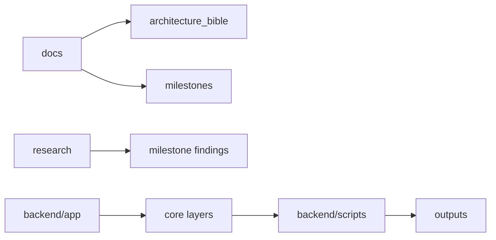

# Folder Responsibilities

## Purpose

Explain what belongs in each top-level and backend folder.

## Scope

This document covers `docs`, `research`, `backend/app`, `backend/scripts`, and generated outputs.

## Background

The repository mixes permanent documentation, milestone research, source code, showcase scripts, and captured outputs. Clear ownership prevents future drift.

## Complete Explanation

- `docs/`: architecture, domain, roadmap, milestone, and user-facing project documentation.
- `docs/architecture_bible/`: canonical long-lived knowledge base.
- `docs/architecture/`: focused architecture snapshots and ADRs.
- `docs/milestones/`: milestone delivery notes.
- `research/`: research findings, failed ideas, questions, and milestone learnings.
- `backend/app/`: source code for core platform layers and services.
- `backend/app/observation`: canonical facts.
- `backend/app/measurement`: measurement operating system.
- `backend/app/evidence`: evidence intelligence platform.
- `backend/app/estimator`, `expertise_mapping`: expertise and latent-state estimation.
- `backend/app/graph`: organization graph primitives and builders.
- `backend/app/agent`: reasoning and tool orchestration.
- `backend/app/forecasting`, `history`, `scenario`, `simulation`: temporal and counterfactual intelligence.
- `backend/app/decision`, `executive`, `organization`: recommendations and executive outputs.
- `backend/scripts`: runnable tests, demos, and showcase pipeline.
- `backend/scripts/outputs`: captured pipeline/showcase outputs.

## Architecture Diagram

## Design Decisions

- Keep architecture bible in `docs` because it is durable product knowledge.
- Keep research in `research` and cross-link instead of copying every raw note.
- Keep generated outputs out of core docs except as evidence references.

## Tradeoffs

Duplicated summaries improve readability but can drift. Cross-links and update discipline are required.

## Failure Cases

- Milestone docs diverge from implementation.
- Research decisions are not migrated into design decisions.
- Showcase scripts become the only documentation of production behavior.

## Edge Cases

- `backend/docs` exists for backend-specific validation docs.
- `docs/Research Accuracy Milestones` contains deep research foundation volumes with spaces in path names.

## Complexity Analysis

Folder responsibility is governance, not runtime complexity.

## Current Implementation Status

The repo already has good raw materials. The bible now consolidates them.

## Known Limitations

No automated documentation freshness checks exist.

## Future Improvements

- Add doc linting for broken links.
- Add architecture-bible update checklist to each milestone.

## Related Documents

- [implementation/Current_Status.md](implementation/Current_Status.md)
- [research/Research_Diary.md](research/Research_Diary.md)

