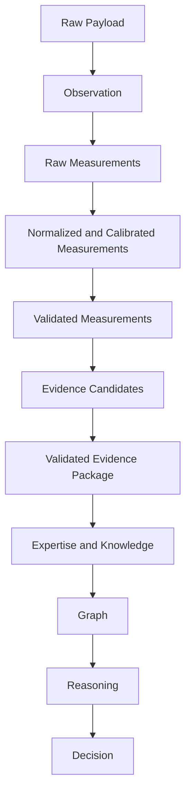
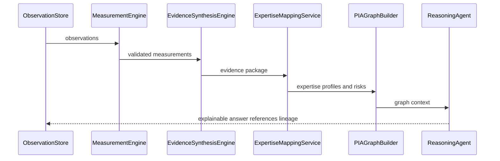

# Data Flow

## Purpose

Describe how data moves through PIA from vendor payload to executive recommendation.

## Scope

This document covers batch and showcase data flow, including lineage and validation gates.

## Background

The current pipeline is canonical: Observation -> Measurement -> Evidence -> Expertise -> Knowledge -> Reasoning -> Decision.

## Complete Explanation

Data flow:

1. Vendor adapter fetches payloads.
2. Adapter translates payloads into canonical observations.
3. Observation validation rejects malformed or duplicate facts.
4. Measurement evaluators compute raw measurements.
5. Normalization, calibration, validation, confidence, uncertainty, and quality stages enrich measurements.
6. Evidence synthesis groups measurements by target entity and evaluates evidence rules.
7. Evidence validation, confidence, ranking, and packaging prepare outputs for expertise.
8. Expertise, ownership, concentration, coverage, successor, and transfer services aggregate evidence into organizational intelligence.
9. Knowledge and graph builders connect entities.
10. Reasoning, forecasting, scenario, decision, and executive services create explanations and recommendations.

## Mathematical Foundations

Data transforms should be pure where possible:

```text
m_i = f_i(o, context)
e_j = g_j({m_i for target t})
k_t = h_t({e_j}, history, graph)
d = pi(k_t, constraints)
```

## Architecture Diagram



## Sequence Diagram



## Design Decisions

- Preserve lineage IDs at every step.
- Group measurements by target entity before evidence rule evaluation.
- Keep validation gates explicit.

## Tradeoffs

Lineage metadata increases payload size, but it is required for explainability.

## Failure Cases

- Duplicate observations inflate activity.
- Calibration on tiny populations produces misleading percentiles.
- Evidence synthesis without grouping creates fragmented facts.

## Edge Cases

- Missing observations can trigger active measurement in future flows.
- Warnings may be allowed when evidence definitions tolerate lower certainty.

## Complexity Analysis

The canonical batch flow is mostly O(n + m + e). Sorting/ranking adds O(k log k). Grouping by entity uses O(m) memory.

## Current Implementation Status

The showcase pipeline has stages for collection, observation, measurement, evidence, knowledge graph, reasoning, decision, validation, and summaries.

## Known Limitations

Live runs depend on repository access and tokens. Offline fixtures need expansion.

## Future Improvements

- Persist intermediate artifacts.
- Add replay CLI for every stage.
- Add data quality dashboards.

## Related Documents

- [measurement_engine/Measurement_Pipeline.md](measurement_engine/Measurement_Pipeline.md)
- [08_Event_Flow.md](08_Event_Flow.md)

