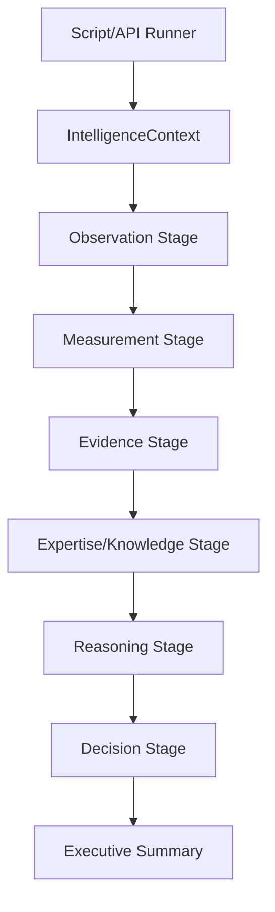
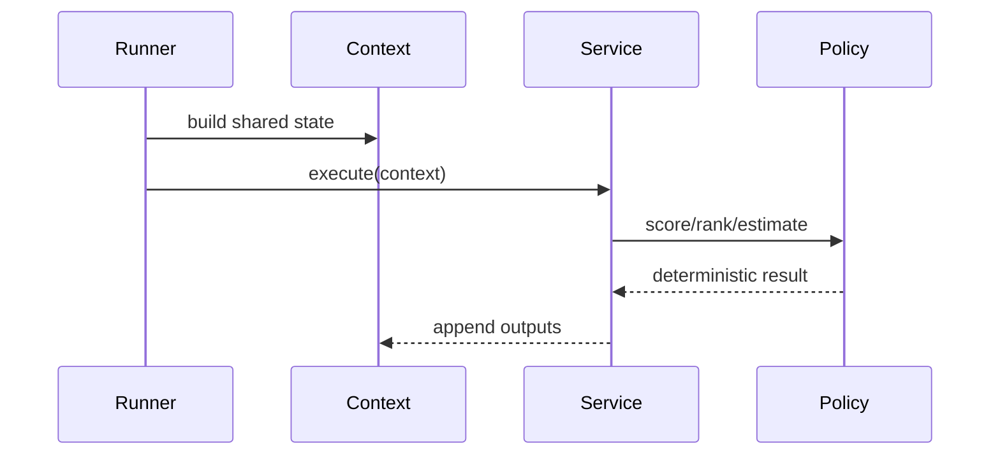

# Control Flow

## Purpose

Describe orchestration, service calls, policies, and control boundaries.

## Scope

This document covers backend services and showcase orchestration.

## Background

The current system is largely synchronous and in-memory. Control flow is explicit through service classes and pipeline stages.

## Complete Explanation

Control starts at either a script/showcase runner, an API facade, or a service call. The orchestrator constructs context, obtains inputs, invokes layer services in order, and passes only layer-approved outputs forward.

Policy classes isolate scoring and ranking decisions:

- measurement evaluators/validators/confidence/quality policies
- expertise scoring and decay policies
- ownership, concentration, coverage, bus-factor policies
- successor, transfer, readiness, forecast policies
- recommendation policies

## Architecture Diagram

## Sequence Diagram

## Design Decisions

- Prefer explicit orchestration over hidden global state.
- Keep policies swappable.
- Keep showcase stages separate from domain services.

## Tradeoffs

Synchronous control is simple and debuggable but not yet optimized for high-volume streaming.

## Failure Cases

- Shared context fields become implicit contracts.
- A policy assumes inputs from a layer it should not know.
- Stage order changes without contract tests.

## Edge Cases

- Some tests call services directly rather than through full pipeline orchestration.
- Legacy event conversion may appear in compatibility paths.

## Complexity Analysis

Control overhead is small compared with data processing. Scenario orchestration scales with number of requested scenarios and services invoked per scenario.

## Current Implementation Status

The showcase pipeline under `backend/scripts/platform_showcase` demonstrates the broadest control path.

## Known Limitations

There is no durable workflow engine or distributed job runner.

## Future Improvements

- Add explicit pipeline manifest.
- Add stage input/output schemas.
- Add retry, checkpoint, and resume support.

## Related Documents

- [09_Lifecycle.md](09_Lifecycle.md)
- [simulation/Scenario_Engine.md](simulation/Scenario_Engine.md)

