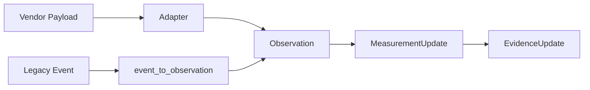
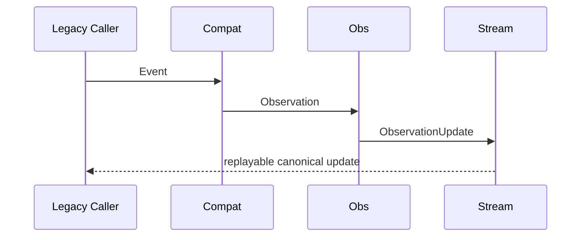

# Event Flow

## Purpose

Clarify the relationship between legacy events, canonical observations, measurement updates, and evidence updates.

## Scope

This document covers event compatibility, streaming concepts, and lifecycle transitions.

## Background

`Event` was the original project source abstraction. It remains for legacy flows, while `Observation` is the canonical production abstraction.

## Complete Explanation

Event-like facts enter the system from vendors. New flows translate them directly into observations. Legacy flows may create `domain.Event`, then bridge to `Observation` through `observation.integration.event_compat`.

Streaming flow:

```text
ObservationUpdate -> MeasurementUpdate -> EvidenceUpdate -> downstream refresh
```

Each update should carry enough identity, sequence, and lineage information to support replay and idempotency.

## Mathematical Foundations

Append-only event streams support state reconstruction:

```text
state_t = fold(apply, initial_state, updates_0:t)
```

Deterministic measurement IDs support idempotency.

## Architecture Diagram



## Sequence Diagram



## Design Decisions

- Treat Event as compatibility, not source of truth.
- Use append-only update streams for replay.
- Preserve deterministic IDs for duplicate resistance.

## Tradeoffs

Keeping Event compatibility reduces migration risk but can confuse new contributors. Documentation must consistently point to Observation.

## Failure Cases

- New code depends on Event instead of Observation.
- Event conversion loses provenance or typed facts.
- Stream subscribers assume exactly-once delivery without idempotency.

## Edge Cases

- A single vendor payload may produce multiple observations.
- A single observation may produce multiple measurements.
- Updates may arrive out of order in future streaming infrastructure.

## Complexity Analysis

Append and replay are O(n). Deduplication is O(1) with indexed IDs and O(n) without indexes.

## Current Implementation Status

Observation, measurement, and evidence streaming primitives exist, but production streaming infrastructure is not yet hardened.

## Known Limitations

No external message broker contract is documented.

## Future Improvements

- Define event bus topics.
- Add idempotency and ordering tests.
- Add durable stream offsets.

## Related Documents

- [06_Data_Flow.md](06_Data_Flow.md)
- [measurement_engine/Storage.md](measurement_engine/Storage.md)

