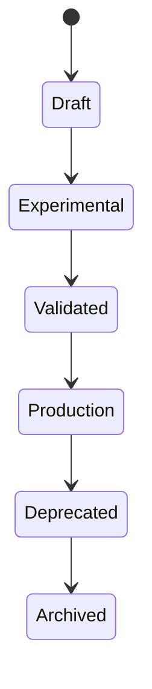
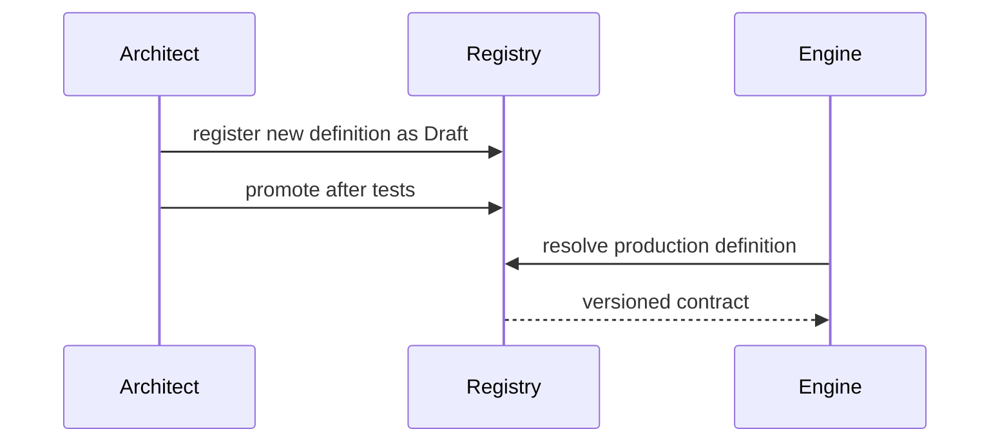

# Lifecycle

## Purpose

Describe lifecycle states for observations, measurements, evidence, research decisions, gaps, and implementation work.

## Scope

This document covers object lifecycle and architecture governance lifecycle.

## Background

PIA relies on immutable records and versioned definitions. Lifecycle state is required to distinguish draft ideas from production contracts.

## Complete Explanation

Object lifecycles:

- Observation lifecycle: active canonical facts, invalid rejected facts, archived history.
- Measurement contract lifecycle: Draft -> Experimental -> Validated -> Production -> Deprecated -> Archived.
- Evidence lifecycle: draft/active/deprecated/retired definitions and current/invalid evidence instances.
- Research lifecycle: question -> investigation -> experiment -> decision -> implementation -> validation -> retrospective.
- Gap lifecycle: identified -> researched -> designed -> implemented -> validated -> closed.

## Mathematical Foundations

Lifecycle transitions should be monotonic for immutable outputs. A deprecated definition should not mutate old records; it should prevent unsafe future use.

## Architecture Diagram

## Sequence Diagram

## Design Decisions

- Never silently reuse deprecated definitions.
- Preserve old outputs for replay and audit.
- Promote only after validation and documented limitations.

## Tradeoffs

Lifecycle governance adds process overhead, but prevents ambiguous metric meaning.

## Failure Cases

- Breaking changes shipped under the same version.
- Deprecated measurements continue feeding decisions.
- Research results are implemented without a decision record.

## Edge Cases

- Experimental measurements may be useful in research but unsafe for executive reporting.
- Warning validation can be acceptable for exploratory evidence but not production decisions.

## Complexity Analysis

Lifecycle checks are O(1) registry lookups when indexed.

## Current Implementation Status

Measurement contracts, evidence lifecycle concepts, observation lifecycle concepts, and versioned evidence registry exist. Governance docs were incomplete before this bible.

## Known Limitations

Promotion criteria are not yet automated.

## Future Improvements

- Add CI checks for deprecated definitions.
- Add lifecycle status dashboards.
- Add architecture review checklist.

## Related Documents

- [research/Design_Decisions.md](research/Design_Decisions.md)
- [implementation/Deprecated.md](implementation/Deprecated.md)

