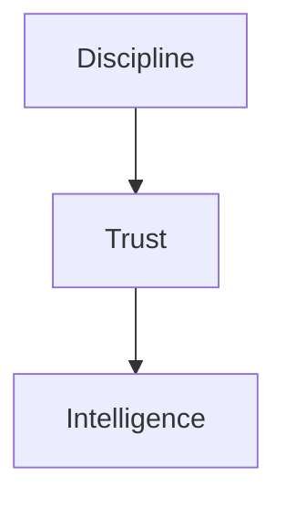
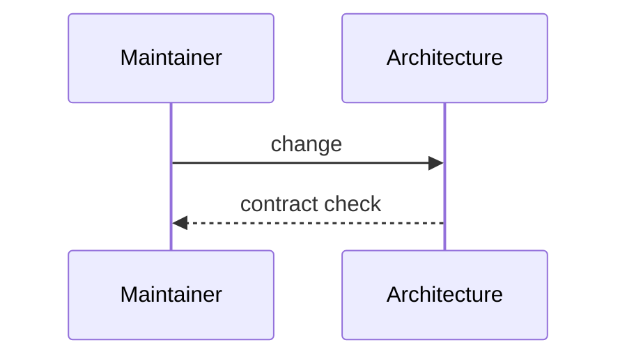

# Architect Notes

## Purpose
Capture principal-architect guidance for future maintainers.
## Scope
Covers philosophy, warnings, and maintenance advice.
## Background
The system's value depends on preserving trust while increasing intelligence.
## Complete Explanation
Do not collapse layers for convenience. Do not let evidence compute measurements. Do not let reasoning hide uncertainty. Do not mistake activity for expertise without confidence. Do not erase failed ideas. Keep lower layers stable and invest in semantic richness above them.
## Mathematical Foundations
Preserve the distinction between observation, measurement, evidence, latent state, and decision.
## Architecture Diagrams

## Sequence Diagrams

## Design Decisions
Future changes should explain which contract they modify.
## Tradeoffs
Architecture discipline is slower but compounds well.
## Failure Cases
Metric dashboards masquerading as intelligence.
## Edge Cases
Temporary prototypes are allowed when labeled and not wired into canonical flow.
## Complexity Analysis
Governance-only.
## Current Implementation Status
Initialized.
## Known Limitations
Notes should grow with milestones.
## Future Improvements
Add milestone-by-milestone retrospectives.
## Related Documents
[../research/Research_Diary.md](../research/Research_Diary.md)

