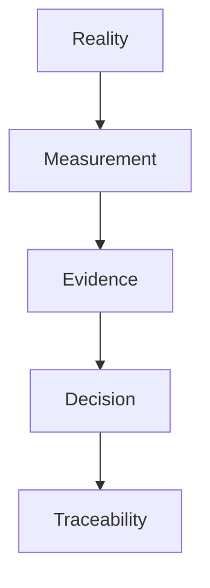
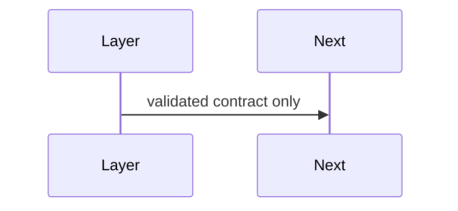

# Design Principles

## Purpose
State enduring design principles.
## Scope
Covers architecture and implementation principles.
## Background
The project matured by choosing scientific contracts over heuristics.
## Complete Explanation
Principles: preserve reality before interpreting it; measure before evidencing; evidence before expertise; expose uncertainty; keep lineage; prefer immutability; version definitions; document failures; optimize after correctness; enrich semantics before rewrites.
## Mathematical Foundations
Layer separation preserves function composition and reduces hidden model error.
## Architecture Diagrams

## Sequence Diagrams

## Design Decisions
These principles guide future decisions.
## Tradeoffs
Principles may slow shortcuts.
## Failure Cases
Ignoring principles recreates rejected designs.
## Edge Cases
Prototype code must be labeled as prototype.
## Complexity Analysis
Governance-only.
## Current Implementation Status
Initialized.
## Known Limitations
No enforcement automation.
## Future Improvements
Add architecture review checklist.
## Related Documents
[../research/Rejected_Designs.md](../research/Rejected_Designs.md)

