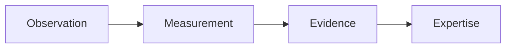
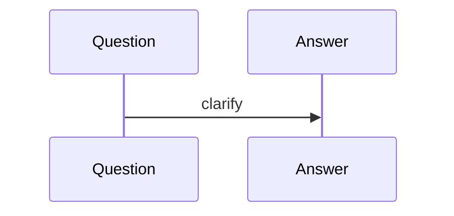

# FAQs

## Purpose
Answer recurring architecture questions.
## Scope
Covers canonical layer boundaries and roadmap.
## Background
The architecture changed significantly from Event-based to Observation-based.
## Complete Explanation
Q: Is Event still canonical? A: No, Observation is canonical. Q: Can Expertise read Measurements? A: No, it reads evidence packages. Q: Is Measurement an analytics helper? A: No, it is the scientific operating system. Q: Is the platform complete? A: The foundation is strong; semantic intelligence is still evolving.
## Mathematical Foundations
FAQs are conceptual, not formulaic.
## Architecture Diagrams

## Sequence Diagrams

## Design Decisions
Use FAQs to prevent contract confusion.
## Tradeoffs
Short answers omit nuance; links provide depth.
## Failure Cases
Contributors bypass canonical layers.
## Edge Cases
Legacy compatibility may still use Event.
## Complexity Analysis
Not applicable.
## Current Implementation Status
Initialized.
## Known Limitations
Small initial FAQ.
## Future Improvements
Append questions from future contributors.
## Related Documents
[Glossary.md](Glossary.md)

