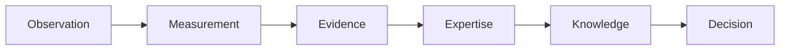
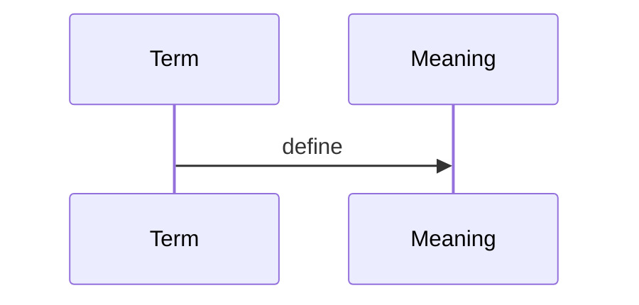

# Glossary

## Purpose
Define common terms.
## Scope
Covers project terminology.
## Background
PIA has evolved terminology across milestones.
## Complete Explanation
Observation: immutable vendor-neutral fact. Measurement: deterministic quantity derived from observations. Evidence: validated interpretation of measurements. Expertise: estimated capability/knowledge relation. Knowledge: semantic organizational memory. Graph: typed relationships between entities. Forecast: projected future state. Scenario: counterfactual analysis. Decision: recommended action.
## Mathematical Foundations
Terms map to the pipeline functions from observations to decisions.
## Architecture Diagrams

## Sequence Diagrams

## Design Decisions
Use canonical terms consistently.
## Tradeoffs
Legacy terms remain in old docs.
## Failure Cases
Event and Observation used interchangeably.
## Edge Cases
Evidence in legacy domain differs from canonical evidence platform object.
## Complexity Analysis
Not applicable.
## Current Implementation Status
Initialized.
## Known Limitations
Short glossary only.
## Future Improvements
Add all class-level terms.
## Related Documents
[../03_Domain_Model.md](../03_Domain_Model.md)

