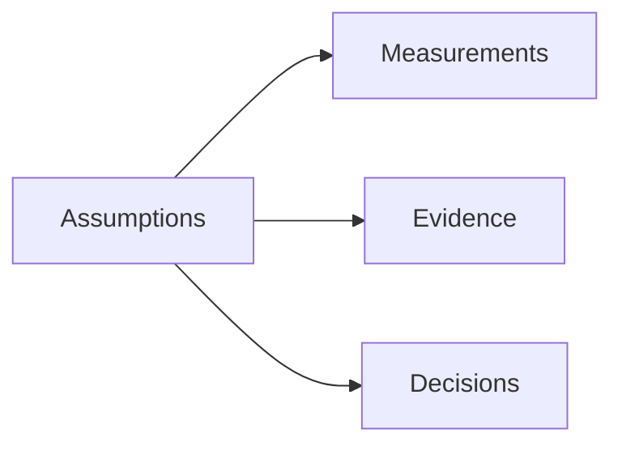
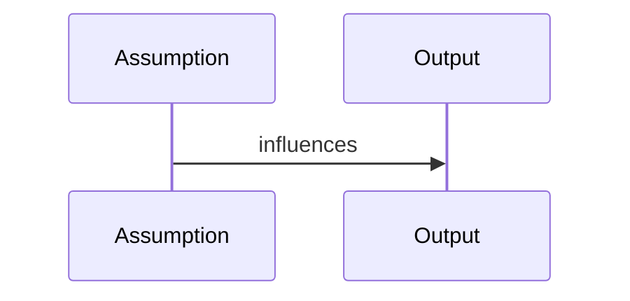

# Hidden Assumptions

## Purpose
Expose assumptions that could otherwise remain implicit.
## Scope
Covers data, models, organization behavior, and operations.
## Background
The prior heuristic pipeline had hidden assumptions; the bible makes them visible.
## Complete Explanation
Assumptions: repository activity reflects knowledge; identities can be resolved; file paths map to meaningful subsystems; measurements are comparable within a context; evidence rules are valid for target cohorts; confidence factors are calibrated enough; decision users understand uncertainty.
## Mathematical Foundations
Hidden assumptions become priors in latent-state inference.
## Architecture Diagrams

## Sequence Diagrams

## Design Decisions
Record assumptions in definitions and evidence limitations.
## Tradeoffs
Explicit assumptions make docs longer but safer.
## Failure Cases
Assumptions fail silently in different organizations.
## Edge Cases
Some teams use tools outside current adapters.
## Complexity Analysis
Not runtime complexity.
## Current Implementation Status
Initialized.
## Known Limitations
Not every code assumption is listed.
## Future Improvements
Add assumption fields to all definitions.
## Related Documents
[../gaps/Risks.md](../gaps/Risks.md)

