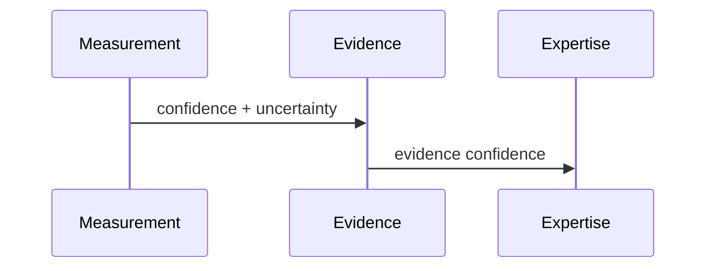

# Confidence Model

## Purpose
Explain confidence propagation across layers.
## Scope
Covers measurement, evidence, expertise, reasoning, and decision confidence.
## Background
Confidence became first-class during the canonical Measurement and Evidence migrations.
## Complete Explanation
Confidence expresses trust in an output, not the output's magnitude. It should account for source reliability, coverage, freshness, agreement, validation, uncertainty, and historical consistency.
## Mathematical Foundations
Current evidence confidence multiplies bounded factors. Future work should calibrate these factors empirically.
## Architecture Diagrams

## Sequence Diagrams

## Design Decisions
Expose confidence breakdowns instead of a single unexplained score.
## Tradeoffs
Factor products are simple but can become over-pessimistic.
## Failure Cases
Uncalibrated confidence can mislead executives.
## Edge Cases
High confidence in a narrow measurement does not imply broad expertise confidence.
## Complexity Analysis
O(number of factors).
## Current Implementation Status
Measurement and evidence confidence engines exist; upper-layer propagation is less mature.
## Known Limitations
No empirical calibration loop for all layers.
## Future Improvements
Add calibration datasets and reliability diagrams.
## Related Documents
[../measurement_engine/Measurement_Math.md](../measurement_engine/Measurement_Math.md)

