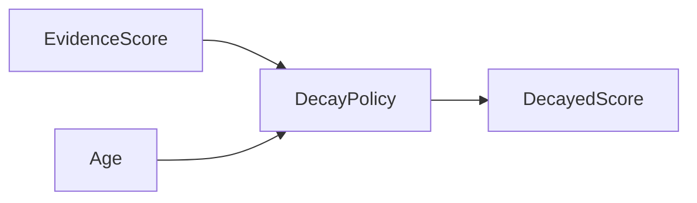
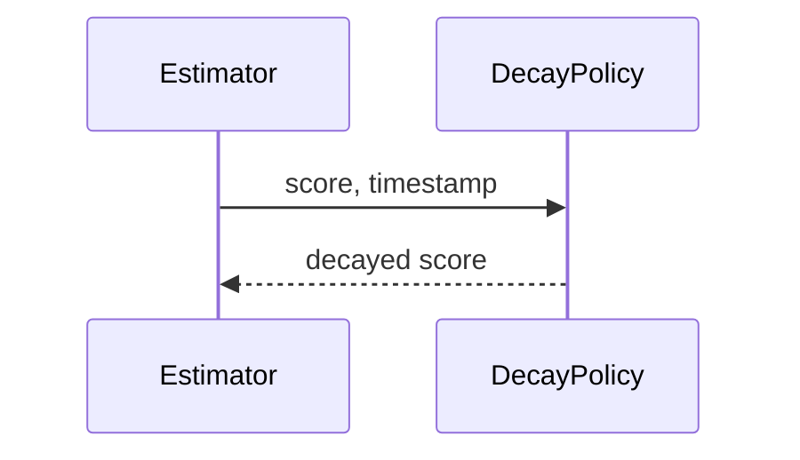

# Decay Model

## Purpose
Document time decay for expertise and organizational knowledge.
## Scope
Covers recency weighting and future temporal state models.
## Background
Expertise changes over time; old activity should usually count less than recent validated evidence.
## Complete Explanation
Decay policies reduce scores as evidence ages. They should be target-aware: stable architecture knowledge decays slower than fast-moving implementation details.
## Mathematical Foundations
`score_t = score_0 * exp(-lambda * age)` is the current conceptual model.
## Architecture Diagrams

## Sequence Diagrams

## Design Decisions
Keep decay policy swappable.
## Tradeoffs
Aggressive decay finds current owners; slow decay preserves institutional knowledge.
## Failure Cases
Decay can erase senior knowledge that is not recently visible.
## Edge Cases
Recently touched files may reflect emergency response, not ownership.
## Complexity Analysis
O(1) per score.
## Current Implementation Status
`ExponentialDecayPolicy` exists.
## Known Limitations
No learned or domain-specific decay rates.
## Future Improvements
Add target-class decay and validation against real ownership.
## Related Documents
[Expertise_Model.md](Expertise_Model.md)

