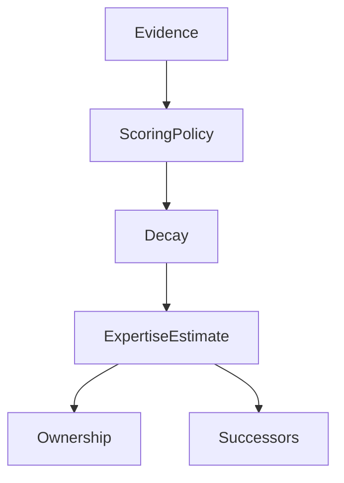
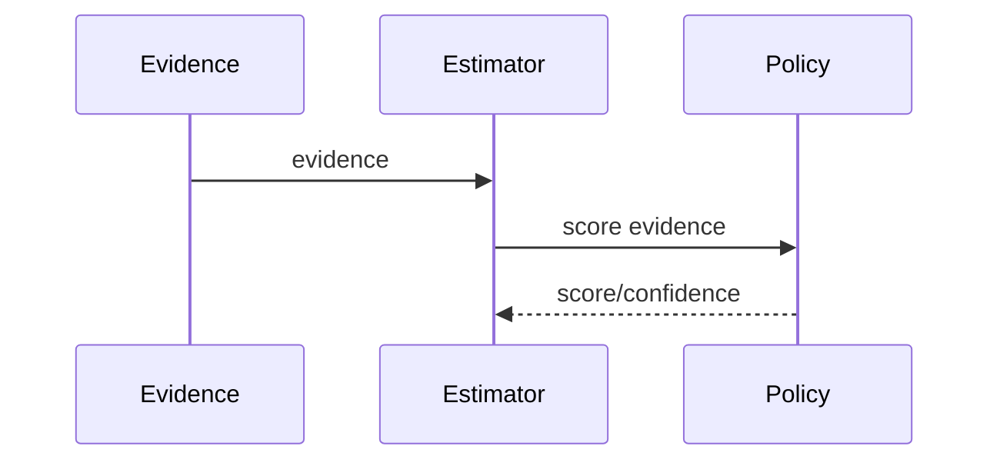

# Expertise Model

## Purpose
Explain how PIA estimates expertise.
## Scope
Covers evidence scoring, decay, file/subsystem/developer expertise, ownership, successors, and transfer.
## Background
Current expertise is still too file-centric, though M37 improved developer and subsystem attribution.
## Complete Explanation
Expertise combines activity strength, evidence quality, recency, breadth, target mapping, and confidence. Services include `ExpertiseEstimator`, `ExpertiseMappingService`, `OwnershipService`, `SuccessorService`, and transfer planning.
## Mathematical Foundations
`expertise = sum(decayed_evidence_score * confidence * weight)` with bounded normalization.
## Architecture Diagrams

## Sequence Diagrams

## Design Decisions
Use policies for scoring so expertise logic can evolve without rewriting services.
## Tradeoffs
Rule policies are transparent; learned expertise models may eventually be more accurate.
## Failure Cases
Activity without understanding, review-only expertise, pair work, and bots.
## Edge Cases
An expert may own a subsystem with few recent commits.
## Complexity Analysis
O(evidence count) for scoring, O(n log n) for ranking.
## Current Implementation Status
Implemented but semantically early.
## Known Limitations
Needs subsystem, technology, reviewer, maintainer, and emerging-expert models.
## Future Improvements
Add graph-backed expertise propagation and calibrated confidence.
## Related Documents
[../measurement_engine/Providers.md](../measurement_engine/Providers.md), [Decay_Model.md](Decay_Model.md)

