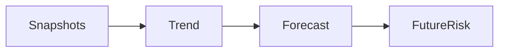
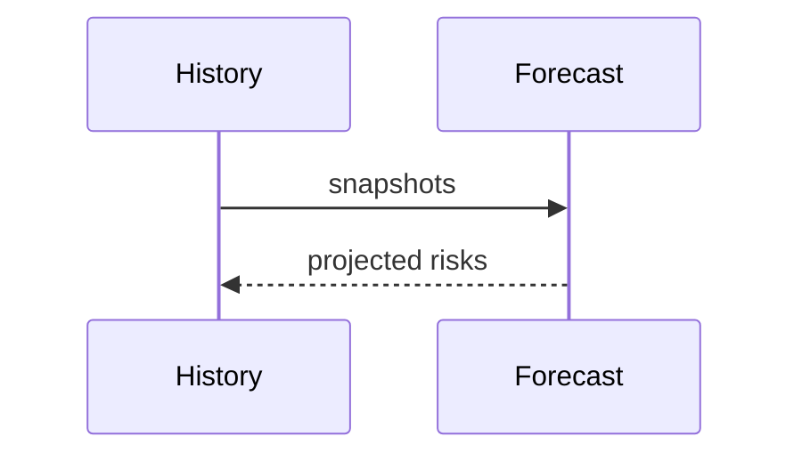

# Estimation Forecasting

## Purpose
Explain how estimates feed future projections.
## Scope
Covers expertise/risk forecasting and relation to `backend/app/forecasting`.
## Background
Current forecasting is early and mostly linear/trend-based.
## Complete Explanation
Forecasting projects health, risk, expertise, or knowledge concentration from historical snapshots. It requires repeated pipeline runs over comparable context.
## Mathematical Foundations
`x_{t+k} = x_t + k * slope` for linear policy; future work can use state-space models.
## Architecture Diagrams

## Sequence Diagrams

## Design Decisions
Use simple forecasts until enough temporal data exists.
## Tradeoffs
Linear forecasts are explainable but miss nonlinear organizational changes.
## Failure Cases
One snapshot cannot support trend forecasting.
## Edge Cases
Org reorgs can invalidate historical continuity.
## Complexity Analysis
O(n) over snapshots for simple trends.
## Current Implementation Status
Forecast services and pipeline services exist.
## Known Limitations
Needs more persisted snapshots.
## Future Improvements
Add confidence intervals and scenario-aware forecasts.
## Related Documents
[../simulation/Forecasting.md](../simulation/Forecasting.md)

