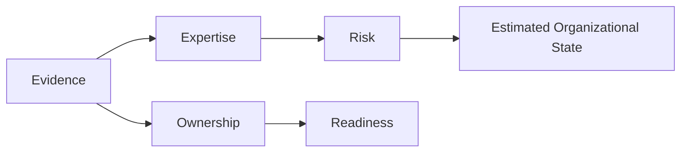
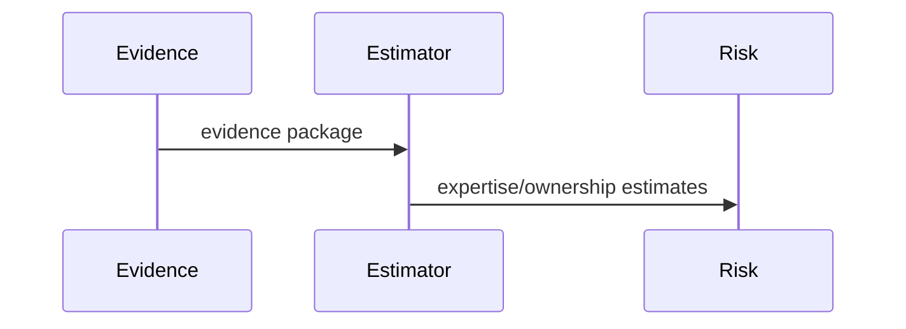

# Latent State Model

## Purpose
Define the hidden organizational state PIA tries to infer.
## Scope
Covers expertise, ownership, readiness, concentration, risk, and future extensions.
## Background
Observable engineering activity is incomplete; PIA estimates hidden state from evidence.
## Complete Explanation
Latent state includes who knows what, who owns what, where risk is concentrated, and how resilient the organization is. Current code approximates this with expertise, ownership, coverage, concentration, health, readiness, and risk services.
## Mathematical Foundations
`p(x_t | evidence_1:t)` is the ideal model. Current implementation mostly computes deterministic scores.
## Architecture Diagrams

## Sequence Diagrams

## Design Decisions
Start with explainable deterministic estimates before probabilistic inference.
## Tradeoffs
Deterministic estimates are auditable but less expressive than posterior distributions.
## Failure Cases
Silent experts, missing data, temporary activity spikes, and alias fragmentation distort state.
## Edge Cases
Low observable activity should lower confidence, not prove low expertise.
## Complexity Analysis
Most estimates are O(n) over evidence or profiles.
## Current Implementation Status
`LatentStateEstimator` abstraction exists; full probabilistic state estimation is planned.
## Known Limitations
No posterior distribution or full state transition model is implemented.
## Future Improvements
Add temporal Bayesian updates and explicit state covariance.
## Related Documents
[Expertise_Model.md](Expertise_Model.md), [Confidence_Model.md](Confidence_Model.md)

