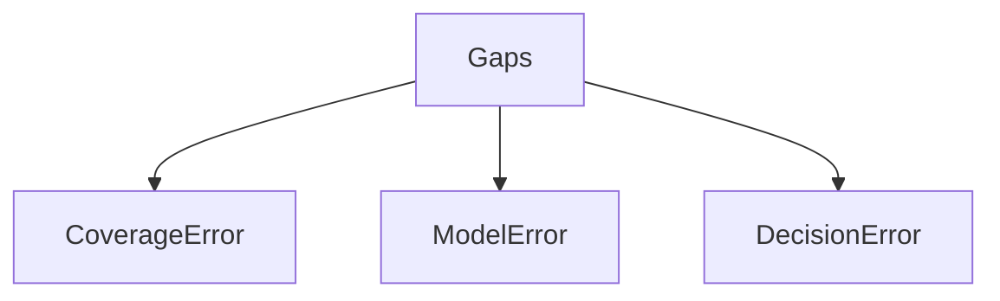
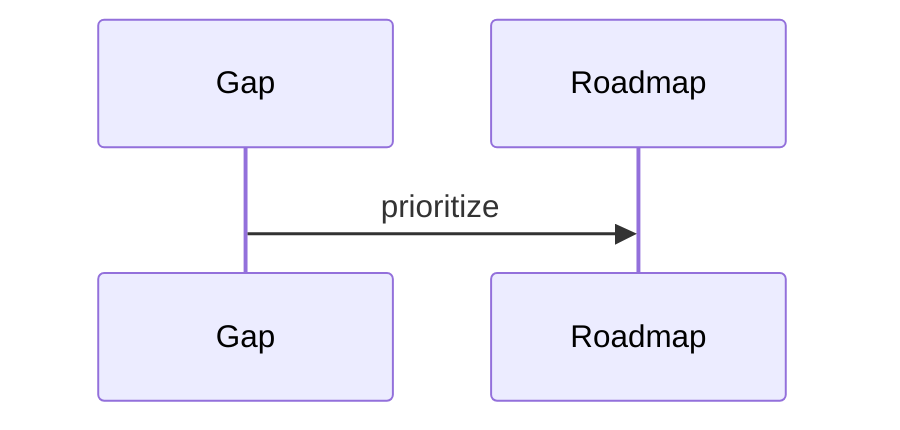

# Gap Register

## Purpose
Maintain the catalog of identified gaps.
## Scope
Covers architecture, research, implementation, validation, performance, and product gaps.
## Background
The canonical roadmap identifies lower-layer maturity and upper-layer semantic gaps.
## Complete Explanation
| Gap | Current Implementation | Ideal Implementation | Research | Implementation | Priority | Difficulty | Impact | Blocking Dependencies | Mathematical Justification |
| --- | --- | --- | --- | --- | --- | --- | --- | --- | --- |
| Semantic expertise | File-heavy | Developer/subsystem/technology/team expertise | Active | Partial | High | High | High | richer evidence/graph | reduces latent-state error |
| Evidence breadth | Few definitions | many domain evidence packs | Active | Partial | High | Medium | High | measurement ontology | improves coverage |
| Temporal forecasting | simple services | validated multi-snapshot forecasts | Active | Partial | High | Medium | High | persisted history | trend needs time series |
| Knowledge graph | partial | entity memory with confidence/provenance | Active | Partial | High | High | High | graph schema | supports relational inference |
| Persistence | in-memory | durable stores | Needed | Planned | High | Medium | High | schema design | enables replay/trends |
| Offline fixtures | limited | full deterministic CI fixtures | Needed | Planned | High | Medium | High | fixture capture | reduces regression risk |
| Decision optimization | rule-based | utility/cost constrained planning | Future | Planned | Medium | High | High | validated risk model | optimizes expected value |
## Mathematical Foundations
Each gap maps to coverage error, measurement error, model error, or decision error.
## Architecture Diagrams

## Sequence Diagrams

## Design Decisions
Track gaps with current and ideal implementation.
## Tradeoffs
High-priority gaps may delay new features.
## Failure Cases
Untracked gaps become architectural surprises.
## Edge Cases
Some gaps are acceptable for research-only demos.
## Complexity Analysis
Varies by gap.
## Current Implementation Status
Initialized.
## Known Limitations
No owner/date fields yet.
## Future Improvements
Add owners, target versions, and validation criteria.
## Related Documents
[Open_Problems.md](Open_Problems.md), [Risks.md](Risks.md)

