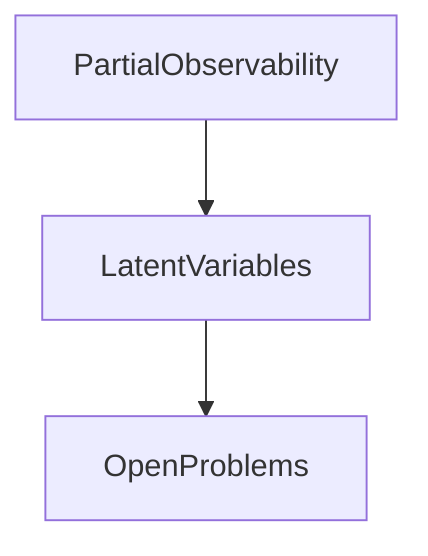
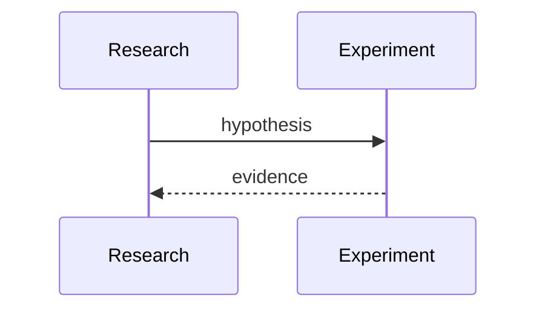

# Open Problems

## Purpose
List unresolved research and engineering problems.
## Scope
Covers problems that need design before implementation.
## Background
The main unknowns are now semantic and probabilistic, not basic pipeline plumbing.
## Complete Explanation
Open problems: calibrating expertise truth, modeling silent experts, resolving team/subsystem ownership, quantifying business impact, choosing graph algorithms, forecasting with sparse snapshots, active measurement, causal reasoning, and utility functions.
## Mathematical Foundations
Many problems require estimating latent variables under partial observability.
## Architecture Diagrams

## Sequence Diagrams

## Design Decisions
Do not hide open problems behind confident UI language.
## Tradeoffs
Research time delays features but improves correctness.
## Failure Cases
Shipping unvalidated inference as fact.
## Edge Cases
Some problems may require human feedback loops.
## Complexity Analysis
Ranges from O(n) experiments to hard inference/optimization.
## Current Implementation Status
Open.
## Known Limitations
No formal research backlog.
## Future Improvements
Create experiment plans per problem.
## Related Documents
[../research/Future_Research.md](../research/Future_Research.md)

