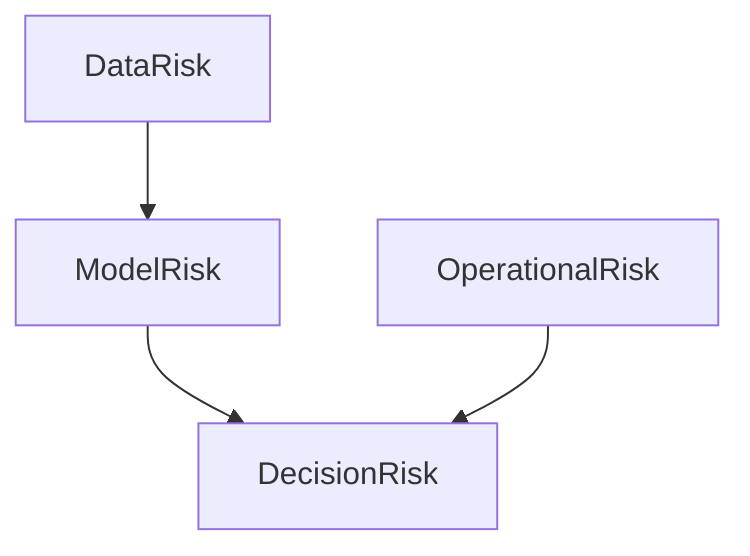
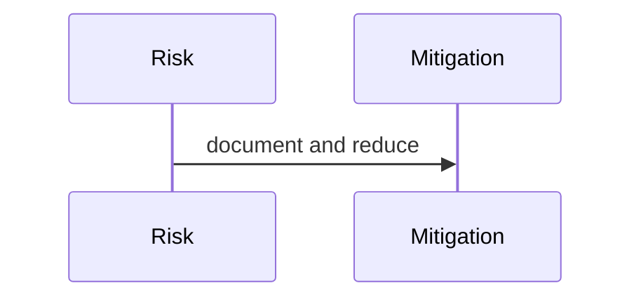

# Risks

## Purpose
Catalog project and system risks.
## Scope
Covers technical, scientific, operational, and product risks.
## Background
PIA's strength is explainability; its risk is false confidence from incomplete signals.
## Complete Explanation
Risks: data sparsity, overreliance on GitHub, file-centric expertise, incomplete ontology, uncalibrated confidence, noisy graph edges, missing persistence, credential-dependent demos, and overclaiming decision intelligence.
## Mathematical Foundations
Risk can be framed as expected loss: `risk = probability * impact * confidence`.
## Architecture Diagrams

## Sequence Diagrams

## Design Decisions
Expose uncertainty and limitations in outputs.
## Tradeoffs
Transparent uncertainty may reduce perceived polish but increases trust.
## Failure Cases
Executives act on unsupported recommendations.
## Edge Cases
High uncertainty can still justify low-cost data-gathering actions.
## Complexity Analysis
Risk analysis is cross-layer.
## Current Implementation Status
Initialized.
## Known Limitations
No severity scoring table yet.
## Future Improvements
Add mitigation owners and review cadence.
## Related Documents
[Gap_Register.md](Gap_Register.md)

