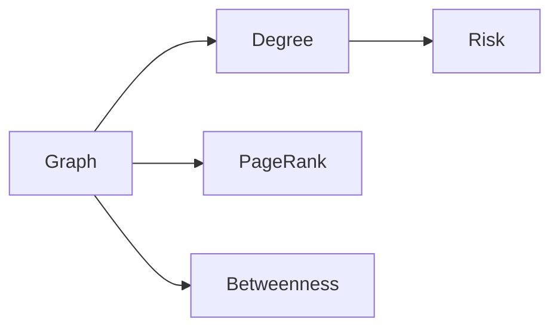
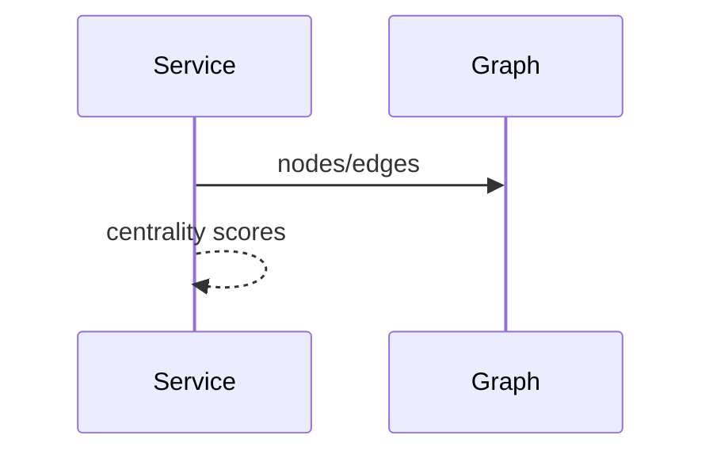

# Centrality

## Purpose
Document centrality as a way to identify bottlenecks and influence.
## Scope
Covers degree, PageRank-like expertise, betweenness, and risk interpretation.
## Background
Future organizational intelligence should use graph algorithms rather than counters alone.
## Complete Explanation
Centrality can identify critical developers, files, subsystems, or dependencies. It must be combined with confidence and edge semantics.
## Mathematical Foundations
Degree centrality counts edges; PageRank recursively weights incoming influence; betweenness counts shortest-path participation.
## Architecture Diagrams

## Sequence Diagrams

## Design Decisions
Do not interpret centrality without edge type and confidence.
## Tradeoffs
Centrality gives insight but can amplify data collection bias.
## Failure Cases
High activity bots or generated files become false hubs.
## Edge Cases
Disconnected components need separate interpretation.
## Complexity Analysis
Degree is O(E); PageRank is O(kE); betweenness can be O(VE).
## Current Implementation Status
Basic graph measurement utilities exist; production centrality is planned.
## Known Limitations
No canonical centrality policy yet.
## Future Improvements
Add typed centrality metrics for expertise, ownership, and dependency risk.
## Related Documents
[Graph_Algorithms.md](Graph_Algorithms.md)

