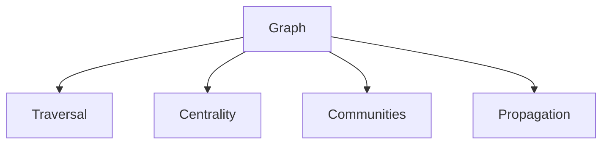
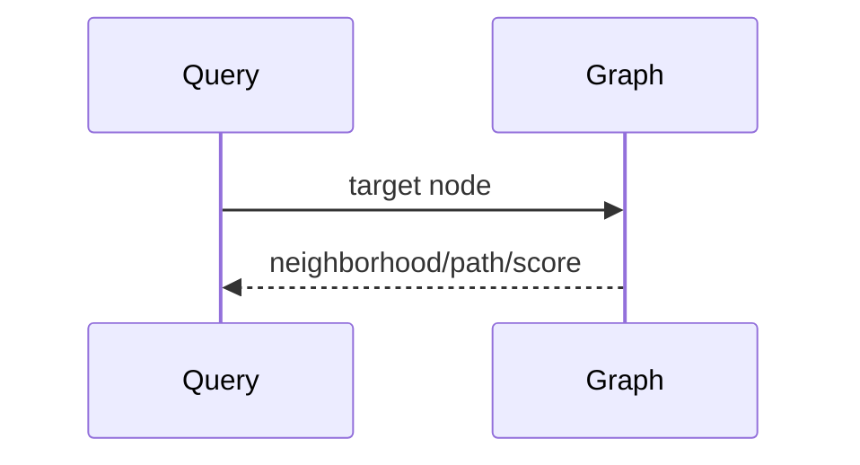

# Graph Algorithms

## Purpose
Catalog graph algorithms relevant to PIA.
## Scope
Covers traversal, centrality, communities, propagation, and dependency analysis.
## Background
Graph intelligence is a major future research direction.
## Complete Explanation
Useful algorithms include BFS/DFS, shortest path, connected components, PageRank, betweenness, community detection, ownership propagation, risk diffusion, and dependency impact analysis.
## Mathematical Foundations
Operate on `G=(V,E)` with typed weighted edges.
## Architecture Diagrams

## Sequence Diagrams

## Design Decisions
Start with explainable algorithms before black-box graph ML.
## Tradeoffs
Graph algorithms are powerful but sensitive to edge quality.
## Failure Cases
Wrong dependency edges create wrong impact analysis.
## Edge Cases
Cycles are expected in collaboration graphs but dangerous in computation DAGs.
## Complexity Analysis
BFS/DFS O(V+E), PageRank O(kE), community algorithms vary.
## Current Implementation Status
Basic graph structures and measurement graph utilities exist.
## Known Limitations
Advanced algorithms are not productionized.
## Future Improvements
Add graph snapshots, typed algorithms, and benchmark datasets.
## Related Documents
[Centrality.md](Centrality.md)

