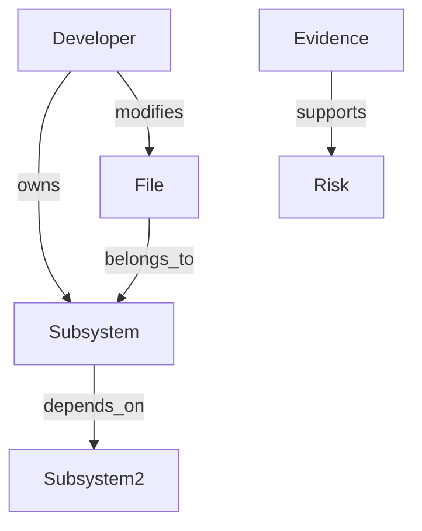
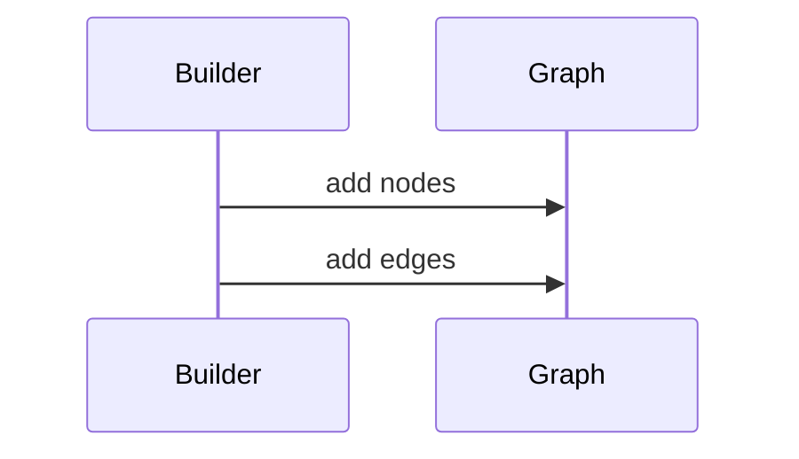

# Graph Model

## Purpose
Define the organization graph.
## Scope
Covers nodes, edges, builders, and graph-backed intelligence.
## Background
The graph layer is the foundation for semantic organizational reasoning.
## Complete Explanation
Nodes should represent developers, files, subsystems, repositories, teams, technologies, evidence, risks, and decisions. Edges include owns, modifies, reviews, depends_on, collaborates_with, supports, contradicts, and successor_of.
## Mathematical Foundations
Graph `G = (V, E)` supports traversal, centrality, communities, paths, and propagation.
## Architecture Diagrams

## Sequence Diagrams

## Design Decisions
Keep graph primitives simple while semantic edges mature.
## Tradeoffs
In-memory graph is easy to inspect but not production scale.
## Failure Cases
Noisy edges make centrality misleading.
## Edge Cases
One entity may appear under multiple aliases.
## Complexity Analysis
Storage is O(V + E); traversal is O(V + E).
## Current Implementation Status
`GraphNode`, `GraphEdge`, `OrganizationalGraph`, `GraphService`, `PIAGraphBuilder` exist.
## Known Limitations
Graph analytics are early.
## Future Improvements
Add persistence, typed edge contracts, and graph queries.
## Related Documents
[Knowledge_Graph.md](Knowledge_Graph.md), [Centrality.md](Centrality.md)

