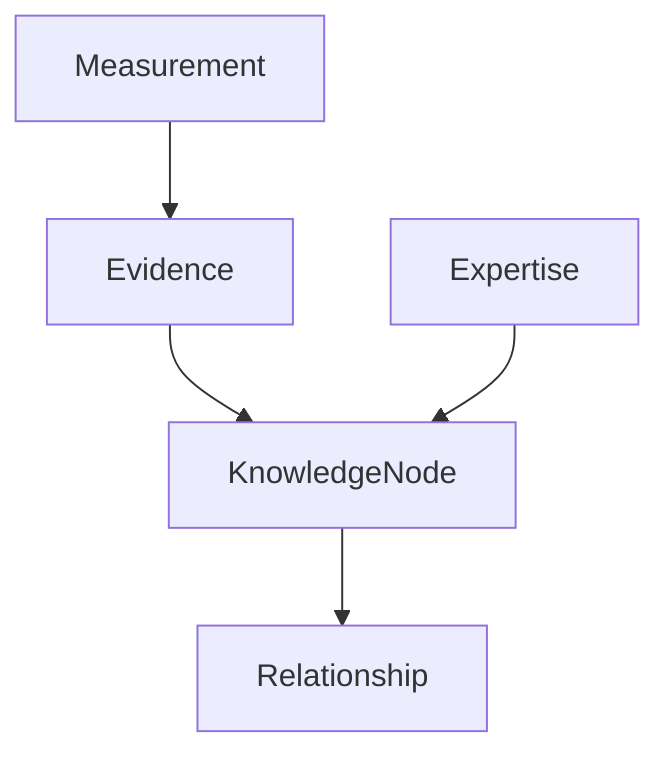
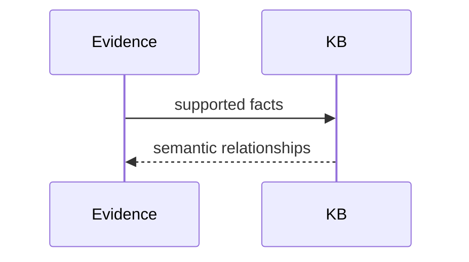

# Knowledge Graph

## Purpose
Explain the semantic memory layer PIA is moving toward.
## Scope
Covers evidence, expertise, measurements, entities, and relationships.
## Background
The canonical roadmap identifies Knowledge as a layer that currently mirrors expertise but should become richer.
## Complete Explanation
Knowledge should be entity-centered: each entity has properties, evidence, measurements, relationships, history, confidence, and limitations.
## Mathematical Foundations
Knowledge graph triples are `(subject, predicate, object)` plus confidence and provenance.
## Architecture Diagrams

## Sequence Diagrams

## Design Decisions
Knowledge should aggregate but not erase provenance.
## Tradeoffs
Semantic richness increases modeling cost.
## Failure Cases
Knowledge facts without evidence become untrusted assertions.
## Edge Cases
Contradictory evidence should be represented, not discarded silently.
## Complexity Analysis
Triple lookup is O(1) with indexes, traversal O(V + E).
## Current Implementation Status
Evidence and measurement knowledge bases exist; full organization knowledge graph is partial.
## Known Limitations
No durable graph database.
## Future Improvements
Add entity schemas and semantic query APIs.
## Related Documents
[../03_Domain_Model.md](../03_Domain_Model.md)

