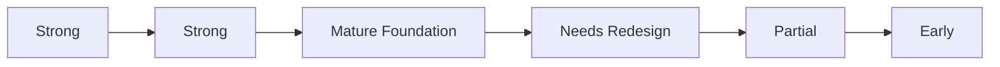
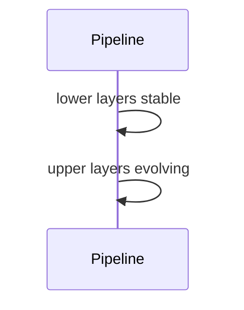

# Current Status

## Purpose
Summarize implementation maturity.
## Scope
Covers all major layers as of July 2026.
## Background
Canonical measurement architecture is complete; upper intelligence needs enrichment.
## Complete Explanation
Observation is production-ready in architecture. Measurement is production-ready foundation with ontology expansion remaining. Evidence is mature foundation with limited definitions. Expertise is weakest canonical layer. Knowledge, graph reasoning, forecasting, and decisions exist but need semantic depth.
## Mathematical Foundations
Status is qualitative, not a formula.
## Architecture Diagrams

## Sequence Diagrams

## Design Decisions
Future work should enrich semantic intelligence rather than rewrite lower plumbing.
## Tradeoffs
Foundation-first approach delayed upper-layer sophistication.
## Failure Cases
Assuming demos equal production readiness.
## Edge Cases
Legacy scripts may not reflect canonical contracts.
## Complexity Analysis
Implementation maturity is not runtime complexity.
## Current Implementation Status
See this document.
## Known Limitations
Persistence, API boundaries, and semantic models need work.
## Future Improvements
Track layer maturity per milestone.
## Related Documents
[Implemented.md](Implemented.md), [Partial.md](Partial.md)

