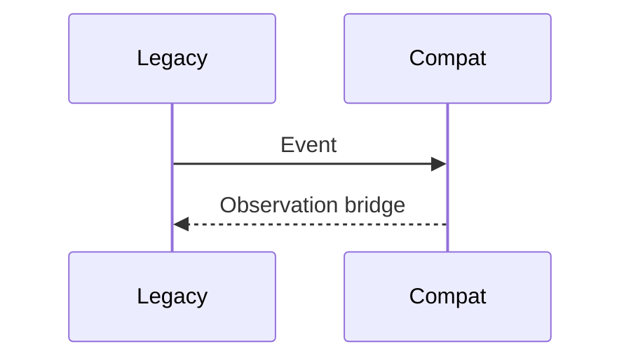

# Deprecated

## Purpose
Document deprecated or legacy patterns.
## Scope
Covers Event-first architecture and direct layer bypasses.
## Background
Legacy `Event` remains for compatibility only.
## Complete Explanation
Deprecated: Event as production source abstraction, direct Event -> Evidence extraction as canonical path, evidence calculating measurements, expertise reading measurements, and unversioned metric semantics.
## Mathematical Foundations
Deprecated patterns collapsed distinct functions `f`, `g`, `h`, and `pi`.
## Architecture Diagrams

## Sequence Diagrams

## Design Decisions
Keep compatibility while steering all new code to canonical layers.
## Tradeoffs
Compatibility reduces breakage but risks confusion.
## Failure Cases
New features built on deprecated flow.
## Edge Cases
Old tests/scripts may still be valid compatibility tests.
## Complexity Analysis
Compatibility adds maintenance overhead.
## Current Implementation Status
Deprecated paths still exist.
## Known Limitations
No automated ban on new Event-first code.
## Future Improvements
Add lint/contract tests.
## Related Documents
[../08_Event_Flow.md](../08_Event_Flow.md)

