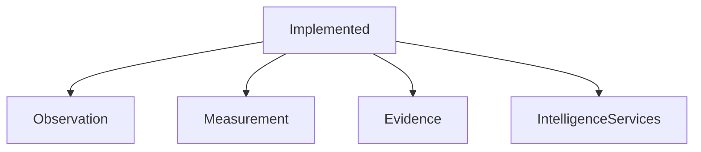
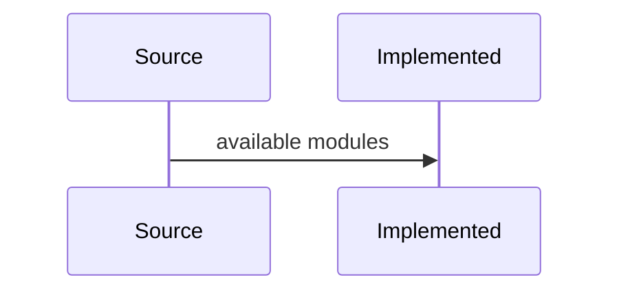

# Implemented

## Purpose
Catalog implemented capabilities.
## Scope
Covers packages and services present in source.
## Background
The codebase includes a broad backend platform.
## Complete Explanation
Implemented: observation models/registry/validation/store/streaming/API/GitHub translation; measurement engine/evaluators/calibration/validation/confidence/quality/fusion/analytics/query/plugins; evidence domain/synthesis/validation/confidence/ranking/query/graph/API; expertise/ownership/coverage/concentration/risk/successor/transfer; graph primitives/builders; forecasting/history/scenario/simulation; agent reasoning; decision/executive/organization services; showcase pipeline.
## Mathematical Foundations
Implemented math includes entropy, decay, calibration, confidence factors, composites, fusion, trends, and graph metrics.
## Architecture Diagrams

## Sequence Diagrams

## Design Decisions
Maintain package-level separation.
## Tradeoffs
Many small services require strong docs.
## Failure Cases
Implemented code without regression tests.
## Edge Cases
Some implemented pieces are prototype-grade.
## Complexity Analysis
Varies by service.
## Current Implementation Status
Broad but uneven maturity.
## Known Limitations
Not every module has production persistence/API.
## Future Improvements
Add generated API inventory.
## Related Documents
[Current_Status.md](Current_Status.md)

