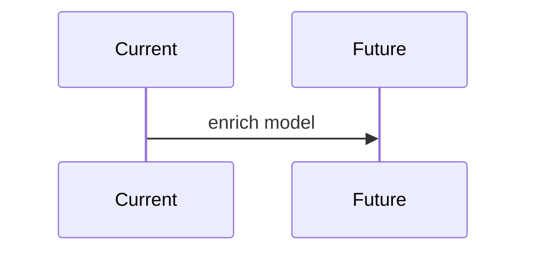

# Partial

## Purpose
List partially implemented areas.
## Scope
Covers implemented foundations that are not complete product capabilities.
## Background
Several layers have scaffolding and early logic but need semantic or operational hardening.
## Complete Explanation
Partial areas: semantic expertise, knowledge layer, graph analytics, probabilistic forecasting, scenario realism, decision optimization, benchmark datasets, persistence, fixture-based CI, production concurrency, tenant isolation, and external APIs.
## Mathematical Foundations
Partial models often use deterministic approximations where probabilistic models are planned.
## Architecture Diagrams

## Sequence Diagrams

## Design Decisions
Mark partial systems explicitly to avoid overclaiming.
## Tradeoffs
Partial implementations enable learning but need clear limits.
## Failure Cases
Executives interpret partial outputs as validated.
## Edge Cases
Demos may use narrower assumptions than production.
## Complexity Analysis
Completion effort varies from tests to new research.
## Current Implementation Status
Open.
## Known Limitations
See this document.
## Future Improvements
Close gaps through roadmap versions.
## Related Documents
[../gaps/Gap_Register.md](../gaps/Gap_Register.md)

