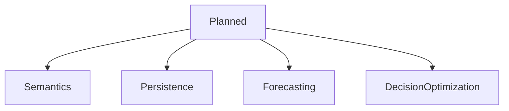
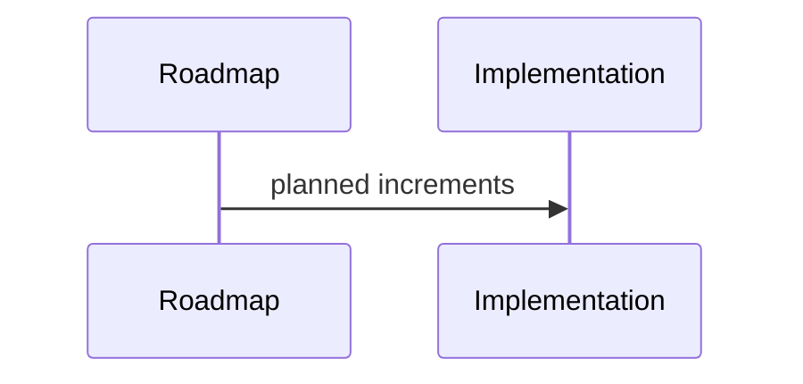

# Planned

## Purpose
Catalog planned implementation work.
## Scope
Covers near and long-term planned capabilities.
## Background
The canonical roadmap says future development should add intelligence, not rewrite foundations.
## Complete Explanation
Planned: richer measurement definitions, evidence domains, semantic expertise, knowledge graph, graph algorithms, temporal snapshots, forecast validation, causal reasoning, decision optimization, fixture-based CI, persistence, telemetry, adapters, and SaaS boundaries.
## Mathematical Foundations
Planned algorithms include Bayesian inference, graph centrality/community detection, state-space forecasting, and utility optimization.
## Architecture Diagrams

## Sequence Diagrams

## Design Decisions
Prioritize semantic enrichment over plumbing rewrites.
## Tradeoffs
Rich semantics require research and validation.
## Failure Cases
Building executive features before data quality supports them.
## Edge Cases
Some customers may need custom measurement/evidence packs earlier.
## Complexity Analysis
Ranges from O(n) evaluators to complex optimization.
## Current Implementation Status
Planned.
## Known Limitations
Not scheduled into issues here.
## Future Improvements
Break into milestones.
## Related Documents
[../roadmap/Architecture_Roadmap.md](../roadmap/Architecture_Roadmap.md)

