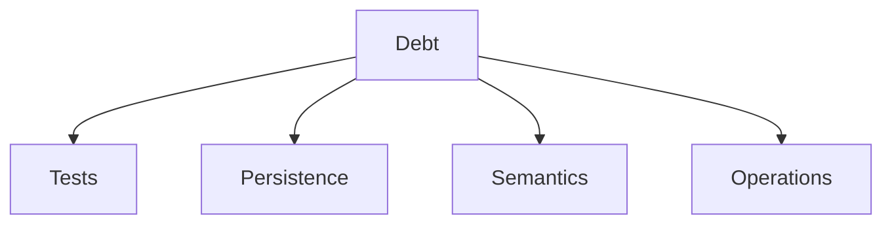
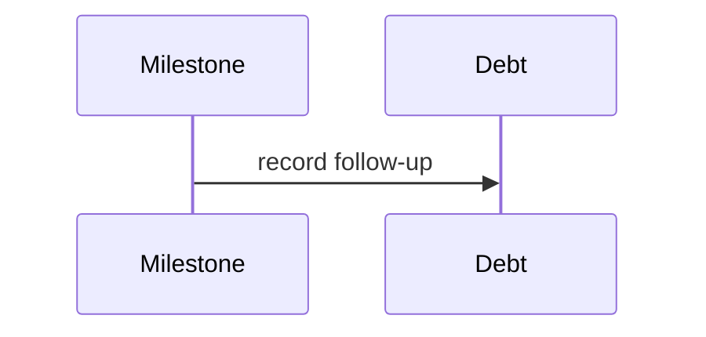

# Technical Debt

## Purpose
Catalog technical debt.
## Scope
Covers tests, persistence, APIs, docs, semantics, and runtime infrastructure.
## Background
The architecture moved quickly through many milestones.
## Complete Explanation
Debt: script-based tests instead of CI suite, sparse fixtures, no production persistence, limited telemetry, no distributed runtime, partial semantic knowledge, file-centric expertise, limited evidence definitions, and no doc freshness automation.
## Mathematical Foundations
Debt increases error probability and maintenance cost.
## Architecture Diagrams

## Sequence Diagrams

## Design Decisions
Track debt explicitly instead of hiding it in TODOs.
## Tradeoffs
Fast research created useful platform breadth but left hardening work.
## Failure Cases
Debt becomes invisible and blocks productionization.
## Edge Cases
Some debt is acceptable in research-only modules.
## Complexity Analysis
Debt payoff varies.
## Current Implementation Status
Open.
## Known Limitations
No priority scoring yet.
## Future Improvements
Move high-priority debt into gap register with owners.
## Related Documents
[../gaps/Gap_Register.md](../gaps/Gap_Register.md)

