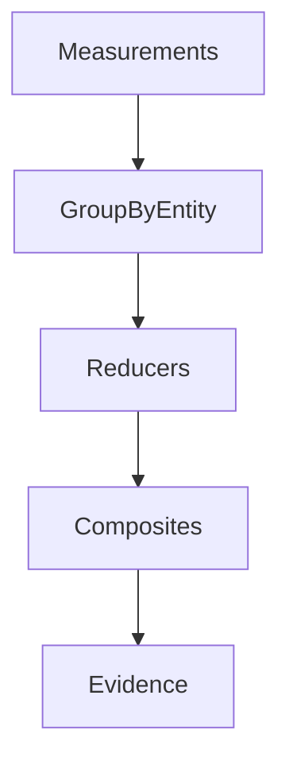

# Aggregation

## Purpose

Explain how measurements are aggregated into higher-level signals.

## Scope

Covers entity grouping, composites, subsystem/developer aggregation, and downstream evidence preparation.

## Background

M37 improved evidence quality by grouping measurements by target entity before rule evaluation.

## Complete Explanation

Aggregation patterns:

- group by target entity
- group by developer identity
- group by subsystem boundary
- aggregate by time window
- build weighted composites
- fuse sources measuring the same concept

## Mathematical Foundations

```text
aggregate(entity) = reducer({measurement | measurement.target = entity})
```

Reducers include sum, mean, max, percentile, entropy, weighted average, and confidence-weighted fusion.

## Architecture Diagram



## Design Decisions

- Aggregate before evidence synthesis when rules target entities.
- Preserve source measurement dependencies.

## Tradeoffs

Aggregation simplifies reasoning but can hide local outliers.

## Failure Cases

- Combining incompatible units.
- Losing low-confidence source details.

## Edge Cases

- Empty groups should not produce confident evidence.

## Complexity Analysis

Grouping is O(n), reducers are O(group size), sorting reducers are O(n log n).

## Current Implementation Status

Composites, fusion, entity grouping in evidence synthesis, and subsystem/developer evaluators exist.

## Known Limitations

Aggregation semantics are not fully centralized.

## Future Improvements

Add aggregation registry and unit compatibility checks.

## Related Documents

- [Measurement_Pipeline.md](Measurement_Pipeline.md)
- [../graph/Graph_Algorithms.md](../graph/Graph_Algorithms.md)

