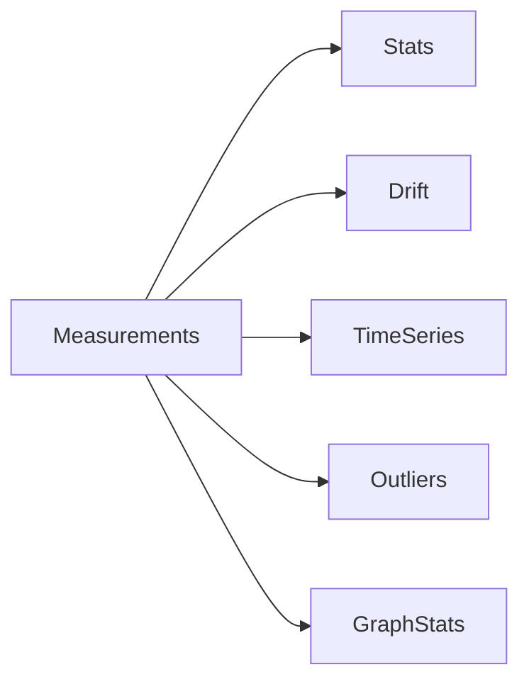

# Analytics

## Purpose

Document measurement analytics utilities.

## Scope

Covers statistics, time series, graph measures, outliers, drift, and compression.

## Background

Measurement analytics support calibration, validation, monitoring, and future forecasting.

## Complete Explanation

Implemented analytics families:

- statistical summaries and correlations
- distribution reports and confidence intervals
- outlier detection by z-score, IQR, and MAD
- drift detection for metric, distribution, and schema changes
- graph measures such as density and centrality
- time-series moving average, EWMA, and trends
- compression primitives

## Mathematical Foundations

```text
mean, variance, correlation, entropy, KL divergence,
EWMA_t = alpha*x_t + (1-alpha)*EWMA_{t-1}
```

## Architecture Diagram



## Design Decisions

- Keep analytics dependency-light initially.
- Use analytics as support for measurement quality, not as hidden decision logic.

## Tradeoffs

Simple analytics are transparent but less powerful than specialized data engines.

## Failure Cases

- Outlier removal hides important risk signals.
- Drift is interpreted without business context.

## Edge Cases

- Sparse time series produce unstable trends.

## Complexity Analysis

Most analytics are O(n). Graph analytics are O(V + E) or iterative.

## Current Implementation Status

Analytics modules exist under `measurement/analytics`.

## Known Limitations

Not yet integrated into a full production monitoring plane.

## Future Improvements

Add persisted analytics snapshots and alerting.

## Related Documents

- [../performance/Complexity.md](../performance/Complexity.md)

