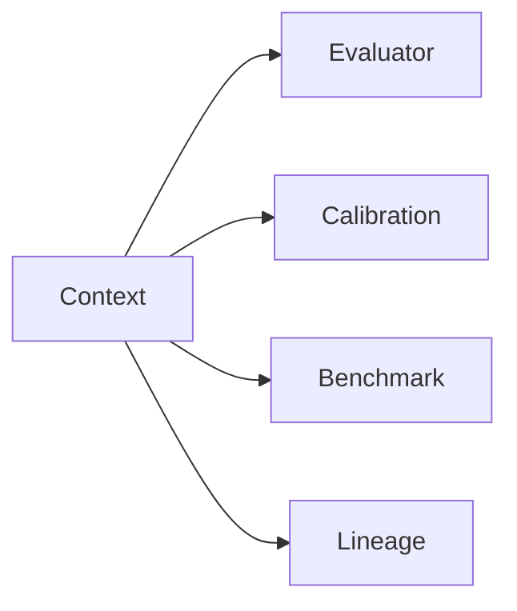

# Context System

## Purpose

Explain context objects that influence measurement execution.

## Scope

Covers tenant, repository, time window, source, benchmark, and execution context.

## Background

Measurements need context to remain interpretable across repositories, teams, tenants, and time windows.

## Complete Explanation

Context should include:

- tenant and repository identifiers
- source platform and adapter
- time window
- benchmark cohort
- algorithm versions
- identity and subsystem resolvers
- trace/correlation IDs

## Mathematical Foundations

Context defines the population for statistics:

```text
calibration_population = measurements where context.cohort matches
```

Changing context changes percentile and benchmark meaning.

## Architecture Diagram



## Design Decisions

- Context must be explicit, not global.
- Tenant and cohort boundaries must not be mixed.

## Tradeoffs

Rich context makes APIs heavier but prevents invalid comparisons.

## Failure Cases

- Cross-tenant benchmark leakage.
- Comparing a small library to an enterprise monorepo without cohort metadata.

## Edge Cases

- Missing context should degrade confidence.
- Historical replay must preserve original context.

## Complexity Analysis

Context lookup should be O(1). Benchmark cohort selection may be O(log n) with indexes.

## Current Implementation Status

`MeasurementContext` and showcase `IntelligenceContext` exist.

## Known Limitations

Context schemas are not yet externally versioned.

## Future Improvements

Add context validation and tenant isolation tests.

## Related Documents

- [Providers.md](Providers.md)
- [Benchmarks.md](../performance/Benchmarks.md)

