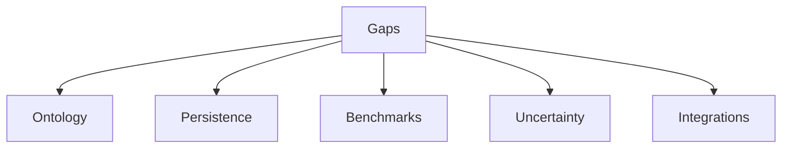

# Measurement Gaps

## Purpose

List known measurement-layer gaps.

## Scope

Covers ontology, validation, persistence, calibration, benchmarks, and scale.

## Background

The measurement framework is strong, but the ontology and operational hardening are incomplete.

## Complete Explanation

Gaps:

- ontology needs many more definitions
- limited benchmark datasets
- no production persistence schema
- minimum sample sizes for calibration need policy
- uncertainty propagation needs improvement
- static analysis and runtime integrations are future work
- active measurement is early

## Mathematical Foundations

Each gap affects inference error:

```text
total_error = measurement_error + coverage_error + calibration_error + model_error
```

## Architecture Diagram



## Design Decisions

- Treat missing measurement definitions as known gaps, not product defects in the core engine.

## Tradeoffs

More definitions increase coverage but also maintenance and validation burden.

## Failure Cases

- Decisions overfit to the few measurements currently available.

## Edge Cases

- Some domains may need qualitative or external measurements.

## Complexity Analysis

Gap closure effort ranges from small evaluator additions to large data-platform work.

## Current Implementation Status

Open.

## Known Limitations

See this document.

## Future Improvements

Prioritize ownership entropy, architectural coupling, review diversity, temporal coupling, subsystem complexity, documentation quality, and testing maturity.

## Related Documents

- [../gaps/Gap_Register.md](../gaps/Gap_Register.md)

