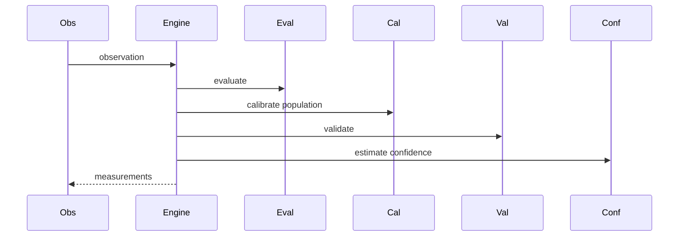

# Measurement Pipeline

## Purpose

Document the end-to-end measurement execution path.

## Scope

Covers evaluator execution, calibration, normalization, validation, confidence, quality, lineage, and batch output.

## Background

M37 added statistical calibration and additional developer/subsystem evaluators.

## Complete Explanation

Pipeline:

```text
Observation
  -> MeasurementEvaluator
  -> statistical calibration
  -> MeasurementNormalizer
  -> MeasurementValidator
  -> ConfidenceEstimator
  -> QualityScorer
  -> Measurement[]
```

## Mathematical Foundations

Calibration transforms a population:

```text
z = (x - mean) / std
percentile = rank(x) / n
```

Confidence and quality are bounded to [0, 1].

## Architecture Diagram



## Design Decisions

- Group batch measurements before statistical calibration.
- Keep evaluator outputs deterministic before calibration metadata.

## Tradeoffs

Batch calibration improves relative interpretation but needs enough samples.

## Failure Cases

- Calibration across incompatible populations.
- Normalization hides raw value meaning.

## Edge Cases

- Missing facts should produce no measurement or explicit low-confidence output.

## Complexity Analysis

O(n) for evaluation and most validation, O(n log n) for percentile ranking.

## Current Implementation Status

Implemented in `MeasurementEngine` with compatibility imports and M37 calibration improvements.

## Known Limitations

No documented minimum sample size gate for all calibration strategies.

## Future Improvements

Add pipeline manifests and stage-level telemetry.

## Related Documents

- [Sampling.md](Sampling.md)
- [Optimization.md](Optimization.md)

