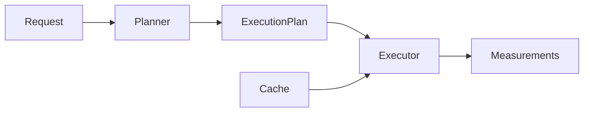

# Optimization

## Purpose

Document measurement execution optimization.

## Scope

Covers execution DAGs, cost-based planning, caching, batch execution, and future scale.

## Background

The measurement layer includes computation nodes, execution plans, an executor, and a cost-based optimizer.

## Complete Explanation

Optimization strategy:

- model dependencies as a DAG
- topologically order computations
- reuse cached values
- choose lower-cost computation paths that satisfy confidence and latency
- batch observations when calibration or I/O benefits from population context

## Mathematical Foundations

Topological sorting is O(V + E). Cost optimization selects:

```text
argmin path_cost(path)
subject to confidence >= threshold and latency <= budget
```

## Architecture Diagram



## Design Decisions

- Optimizers should not change measurement meaning.
- Cache reuse must preserve definition/version identity.

## Tradeoffs

Optimization adds complexity and invalidation risk.

## Failure Cases

- Reusing cached values across incompatible context.
- Optimizer chooses lower-cost but lower-validity path.

## Edge Cases

- Cycles in derived measurement dependencies must be rejected.

## Complexity Analysis

Planning is O(V + E); path selection depends on number of candidate paths.

## Current Implementation Status

DAG planner, executor, and cost optimizer primitives exist.

## Known Limitations

No distributed execution runtime.

## Future Improvements

Add OpenTelemetry spans, parallel execution, and persistent cache backends.

## Related Documents

- [../performance/CPU.md](../performance/CPU.md)
- [../performance/Concurrency.md](../performance/Concurrency.md)

