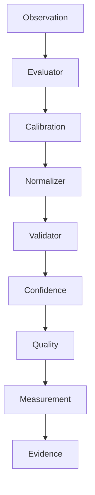

# Measurement Engine Overview

## Purpose

Explain the Measurement Operating System as the deterministic bridge from observations to evidence.

## Scope

Covers responsibilities, contracts, components, math, limitations, and roadmap for `backend/app/measurement`.

## Background

Measurement was introduced to replace hidden heuristic extraction with reproducible, validated, unit-aware quantities.

## Complete Explanation

The engine consumes only canonical observations. It produces immutable `Measurement` objects containing value, unit, method, confidence, uncertainty, quality, validation, provenance, traceability, dependencies, and version.

Core components:

- domain models and registry
- evaluators
- normalization and calibration
- validation
- confidence and quality scoring
- derived and composite calculations
- fusion
- lineage and explanation
- analytics, benchmarks, storage, streaming, plugins, and query APIs

## Mathematical Foundations

```text
measurement = evaluator(observation, context)
normalized = normalizer(measurement)
validated = validator(normalized)
confidence = reliability(source, coverage, freshness, agreement)
quality = q(confidence, uncertainty, validation)
```

## Architecture Diagram



## Design Decisions

- Measurements are deterministic source-of-record outputs.
- ML may calibrate or annotate but not replace deterministic measurement.
- New algorithms enter through interfaces.

## Tradeoffs

The layer is larger than a metric helper library, but gives PIA scientific integrity.

## Failure Cases

- Tiny samples mislead statistical calibration.
- Invalid measurements reach evidence.
- Definitions change without versioning.

## Edge Cases

- Warning validation can be permitted by evidence policy.
- Derived measurements must preserve dependency IDs.

## Complexity Analysis

Base execution is O(observations * evaluators). Calibration adds O(n) or O(n log n) depending on strategy.

## Current Implementation Status

Mature foundation with current evaluators for complexity, impact, file activity, file ownership, developer activity, and subsystem activity.

## Known Limitations

Ontology is still small relative to the long-term vision.

## Future Improvements

Add hundreds of measurement definitions, persistence, benchmarks, and richer uncertainty propagation.

## Related Documents

- [Measurement_Pipeline.md](Measurement_Pipeline.md)
- [Measurement_Math.md](Measurement_Math.md)

