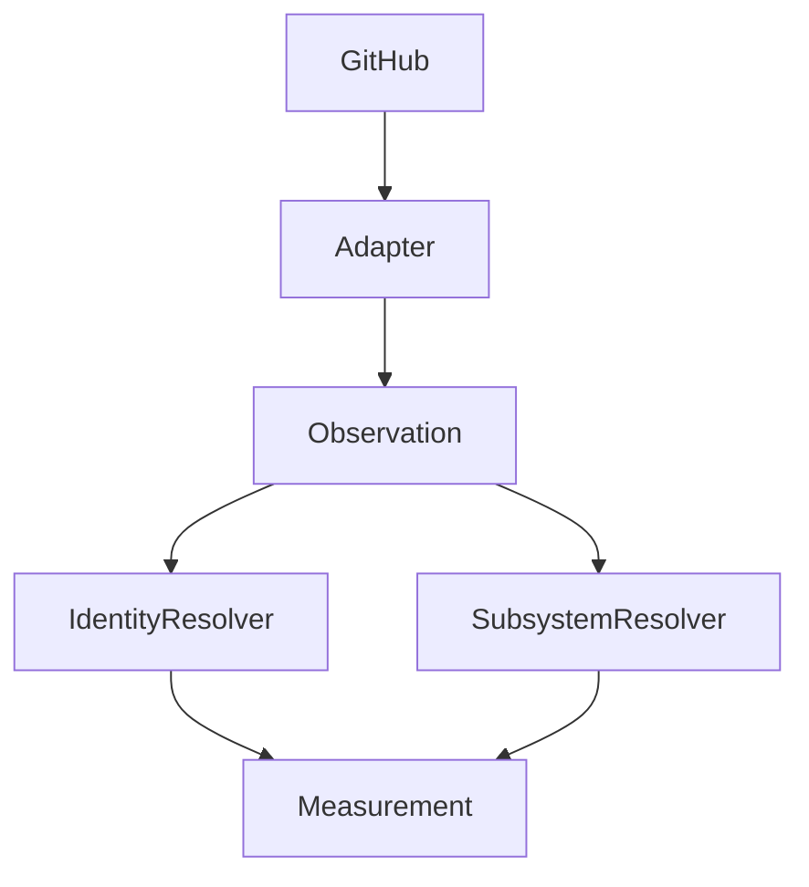

# Providers

## Purpose

Document source providers and boundary resolvers that feed measurement.

## Scope

Covers adapters, identity resolution, subsystem resolution, and future provider expansion.

## Background

M37 introduced canonical subsystem boundary and developer identity resolution.

## Complete Explanation

Provider-related components:

- `GitHubAdapter` and GitHub gateways fetch source data.
- `GitHubObservationTranslator` creates canonical observations.
- `DeveloperIdentityResolver` canonicalizes developer aliases.
- `SubsystemResolver` maps files to subsystems using providers for monorepos, Rust crates, Node packages, compiler subdirectories, and fallback paths.

## Mathematical Foundations

Identity resolution is a mapping problem:

```text
alias -> canonical developer id
file path -> subsystem id
```

Errors propagate into ownership and expertise estimates.

## Architecture Diagram



## Design Decisions

- Resolve identities and boundaries before ownership/knowledge mapping.
- Keep provider heuristics isolated.

## Tradeoffs

Heuristic boundary detection is fast but imperfect.

## Failure Cases

- Aliases split one human into multiple developers.
- Subsystem fallback groups unrelated paths.

## Edge Cases

- Monorepos can contain multiple package systems.
- Bots and service accounts may need exclusion.

## Complexity Analysis

Path and alias lookups are O(1) to O(depth) depending on provider.

## Current Implementation Status

GitHub provider and several subsystem providers exist.

## Known Limitations

No enterprise identity provider integration exists yet.

## Future Improvements

Add SCIM/SSO mapping, team ownership files, CODEOWNERS, and language-specific boundary plugins.

## Related Documents

- [Context_System.md](Context_System.md)
- [../estimation/Expertise_Model.md](../estimation/Expertise_Model.md)

