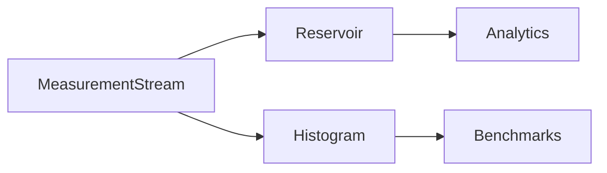

# Sampling

## Purpose

Document sampling and approximation strategies for large measurement histories.

## Scope

Covers reservoir sampling, histograms, and future sampling policies.

## Background

The measurement analytics package includes dependency-free compression primitives.

## Complete Explanation

Sampling is needed when complete history is too expensive to keep in hot memory. Current primitives include reservoir sampling and approximate histogram building.

## Mathematical Foundations

Reservoir sampling keeps a uniform sample of size k from a stream of unknown length n.

```text
for item i:
  keep with probability k / i
```

## Architecture Diagram



## Design Decisions

- Keep exact immutable records where possible.
- Use approximations for analytics summaries, not source of record.

## Tradeoffs

Approximation reduces memory and latency but introduces error.

## Failure Cases

- Samples used for audit instead of summaries.
- Biased sampling due to tenant or time-window mixing.

## Edge Cases

- Very small streams should use exact values.

## Complexity Analysis

Reservoir sampling is O(n) time and O(k) memory.

## Current Implementation Status

Reservoir and histogram primitives exist.

## Known Limitations

No error-bound reporting is standardized.

## Future Improvements

Add t-digest or quantile sketches when dependencies are acceptable.

## Related Documents

- [Analytics.md](Analytics.md)
- [Storage.md](Storage.md)

