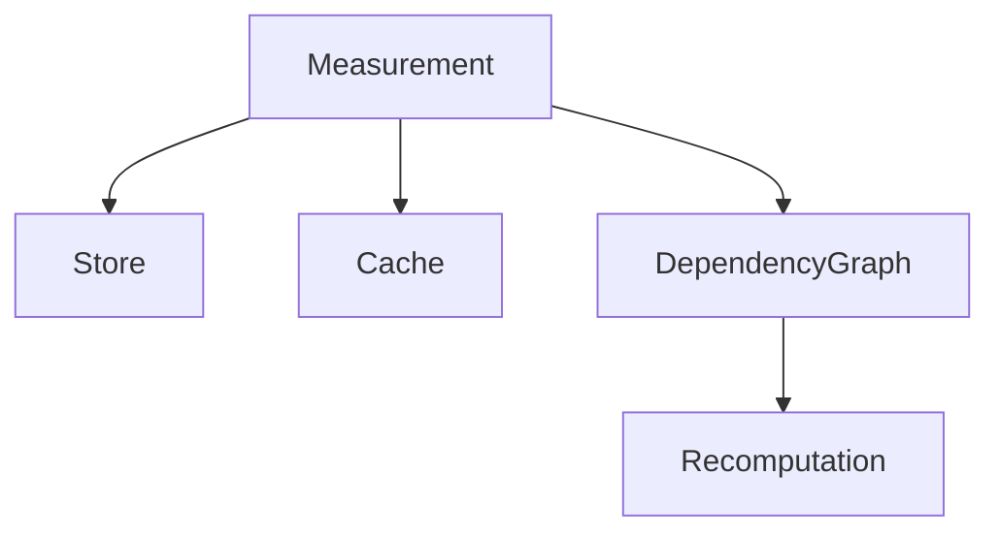

# Storage

## Purpose

Explain measurement storage, cache, replay, and recomputation responsibilities.

## Scope

Covers temporal stores, caches, dependency graph, and future persistence.

## Background

Measurements should be append-only and replayable like observations.

## Complete Explanation

Storage concepts:

- `TemporalMeasurementStore` appends historical measurement values.
- `MeasurementCache` separates hot, derived, historical, and persistent tiers.
- `MeasurementDependencyGraph` identifies derived measurements affected by source changes.

## Mathematical Foundations

Recomputation follows dependency graph reachability:

```text
affected = descendants(changed_measurement)
```

## Architecture Diagram



## Design Decisions

- Store history rather than overwriting current state.
- Use stable IDs for idempotency.

## Tradeoffs

Append-only history costs storage but enables trend analysis and audit.

## Failure Cases

- Cache serving stale derived values.
- Missing dependency edges preventing recomputation.

## Edge Cases

- Replayed historical definitions must use original versions.

## Complexity Analysis

Append is O(1). Dependency traversal is O(V + E) over affected subgraph.

## Current Implementation Status

In-memory temporal store, cache, and dependency graph primitives exist.

## Known Limitations

No production database schema is defined.

## Future Improvements

Add DuckDB/SQL/columnar storage design and retention policies.

## Related Documents

- [../08_Event_Flow.md](../08_Event_Flow.md)

