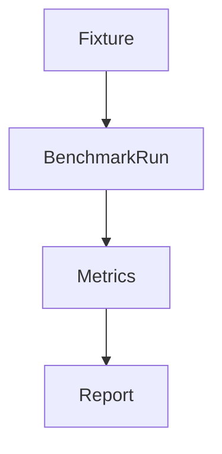
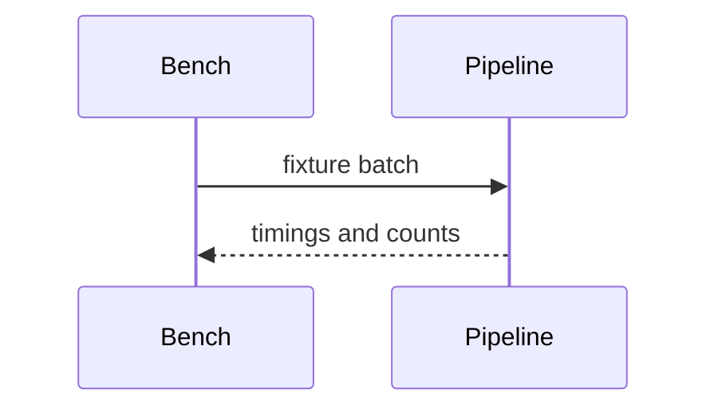

# Benchmarks

## Purpose
Define benchmark strategy.
## Scope
Covers measurement, evidence, graph, forecast, and showcase benchmarks.
## Background
Existing scripts validate behavior but are not a formal benchmark suite.
## Complete Explanation
Track events/sec, observations/sec, measurements/sec, evidence/sec, latency percentiles, memory per 10k observations, graph build time, scenario throughput, and cache hit rate.
## Mathematical Foundations
Use distribution summaries: mean, median, p95, p99, standard deviation.
## Architecture Diagrams

## Sequence Diagrams

## Design Decisions
Use fixed offline fixtures before live-vendor benchmarks.
## Tradeoffs
Fixtures are reproducible but may not reflect real repositories.
## Failure Cases
Benchmarking live APIs measures network/token limits instead of engine speed.
## Edge Cases
Cold cache and warm cache should be separate runs.
## Complexity Analysis
Benchmark overhead should be small relative to measured work.
## Current Implementation Status
Planned; outputs exist but are not formal benchmark reports.
## Known Limitations
No baseline thresholds.
## Future Improvements
Add CI perf smoke tests.
## Related Documents
[Performance_Guide.md](Performance_Guide.md)

