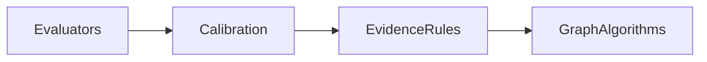
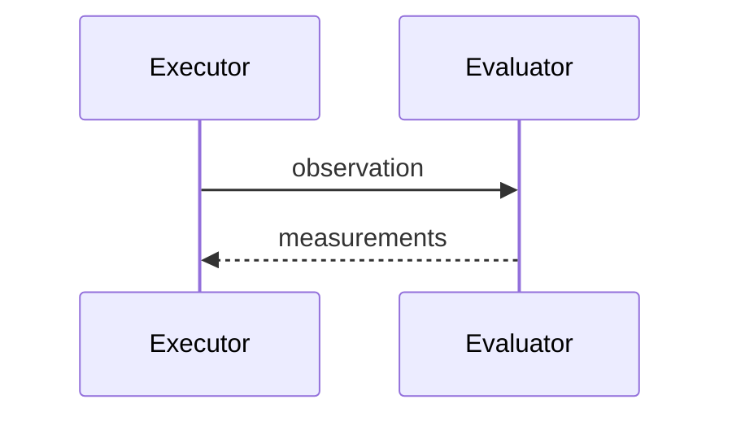

# CPU

## Purpose
Document CPU hot spots.
## Scope
Covers measurement evaluation, validation, calibration, evidence synthesis, graph, and scenario services.
## Background
Most code is Python and dependency-light.
## Complete Explanation
CPU work is dominated by per-record evaluators, batch calibration, sorting/ranking, graph algorithms, and repeated scenario simulations.
## Mathematical Foundations
CPU time follows complexity plus constants for dataclass creation and validation.
## Architecture Diagrams

## Sequence Diagrams

## Design Decisions
Optimize evaluator interfaces before parallelizing.
## Tradeoffs
Parallelism can reduce latency but complicates context and determinism.
## Failure Cases
Repeated recomputation without dependency graph/cache.
## Edge Cases
Python startup dominates tiny CLI scripts.
## Complexity Analysis
Mostly O(n), with sort and graph exceptions.
## Current Implementation Status
No CPU profiling baseline.
## Known Limitations
No worker pool or vectorized backend.
## Future Improvements
Profile, batch, cache, then consider Polars/Arrow or multiprocessing.
## Related Documents
[Optimization.md](../measurement_engine/Optimization.md)

