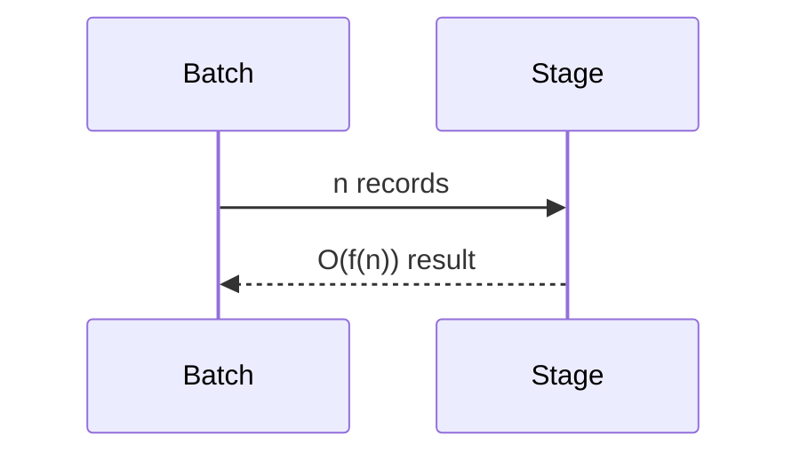

# Complexity

## Purpose
Catalog expected algorithmic complexity.
## Scope
Covers major layers.
## Background
Complexity is currently manageable but graph and optimization work can grow.
## Complete Explanation
Observation validation O(n), measurement evaluation O(n*e), calibration O(n) to O(n log n), evidence synthesis O(m*r) reduced by grouping, ranking O(k log k), graph traversal O(V+E), scenario O(s*model_cost).
## Mathematical Foundations
Use Big-O for scaling and empirical benchmarks for constants.
## Architecture Diagrams

## Sequence Diagrams

## Design Decisions
Prefer linear algorithms for core pipeline.
## Tradeoffs
Advanced intelligence may require heavier graph/optimization algorithms.
## Failure Cases
Unbounded pairwise comparisons over large histories.
## Edge Cases
Dense graphs behave very differently from sparse graphs.
## Complexity Analysis
This document is the complexity index.
## Current Implementation Status
Most implemented services are linear or sort-bound.
## Known Limitations
No formal complexity tests.
## Future Improvements
Add load tests around graph and evidence synthesis.
## Related Documents
[CPU.md](CPU.md), [Memory.md](Memory.md)

